---
## Front matter
lang: ru-RU
title: Лабораторная работа №1
subtitle: Операционные системы
author:
  - Трусова А. А.
institute:
  - Российский университет дружбы народов, Москва, Россия
date: 08 марта 2025

## i18n babel
babel-lang: russian
babel-otherlangs: english

## Formatting pdf
toc: false
toc-title: Содержание
slide_level: 2
aspectratio: 169
section-titles: true
theme: metropolis
header-includes:
 - \metroset{progressbar=frametitle,sectionpage=progressbar,numbering=fraction}
---

# Вводная часть

## Цель

Целью данной работы является приобретение практических навыков установки операционной системы на виртуальную машину, настройки минимально необходимых для дальнейшей работы сервисов.

## Задачи

1. Работа с операционной системой после установки
2. Установка программного обеспечения для создания документации
3. Домашнее задание
4. Контрольные вопросы

# Выполнение лабораторной работы

## Работа с операционной системой после установки

Установила средства разработки (рис. [-@fig:001]).

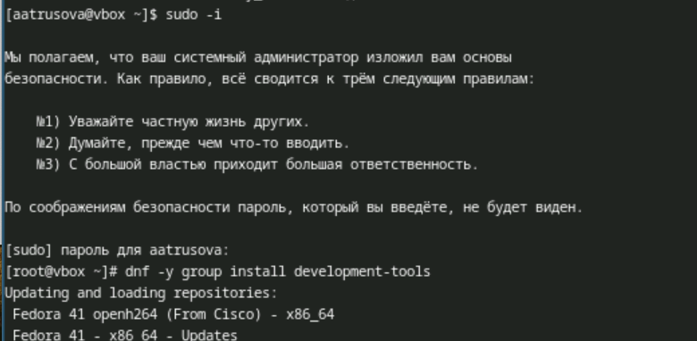{#fig:001 width=70%}

## Работа с операционной системой после установки

Обновила все пакеты (рис. [-@fig:002]).

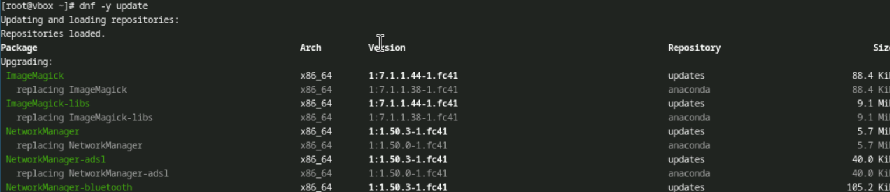{#fig:002 width=70%}

## Работа с операционной системой после установки

Скачала midnight commander (рис. [-@fig:003]).

{#fig:003 width=70%}

## Работа с операционной системой после установки

Установила программное обеспечение (рис. [-@fig:004]).

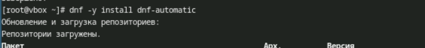{#fig:004 width=70%}

## Работа с операционной системой после установки

Запустила таймер (рис. [-@fig:005]).

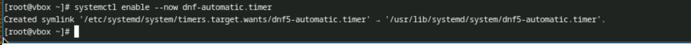{#fig:005 width=70%}

## Работа с операционной системой после установки

Меняю файл /etc/selinux/config, чтобы отключить selinux (рис. [-@fig:006]).

{#fig:006 width=70%}

## Работа с операционной системой после установки

Создала конфигурационный файл ~/.config/sway/config.d/95-system-keyboard-config.conf и открыла его с помощью nano (рис. [-@fig:007]).

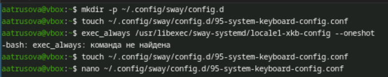{#fig:007 width=70%}

## Работа с операционной системой после установки

Изменила этот файл (рис. [-@fig:008]).

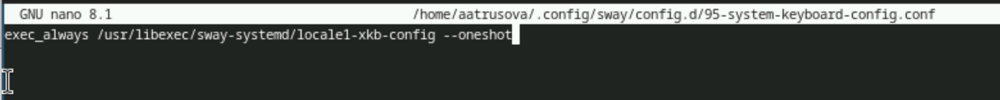{#fig:008 width=70%}

## Работа с операционной системой после установки

Отредактировала конфигурационный файл /etc/X11/xorg.conf.d/00-keyboard.conf (рис. [-@fig:009]).

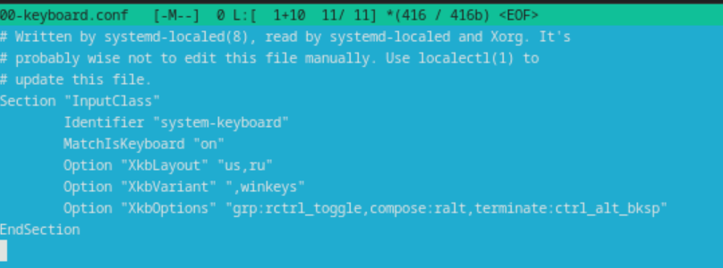{#fig:009 width=70%}

## Работа с операционной системой после установки

Переключилась на роль супер-пользователя, создала пользователя (он уже существовал), задала для него пароль, установила имя хоста и проверила правильность выполнения (рис. [-@fig:010]).

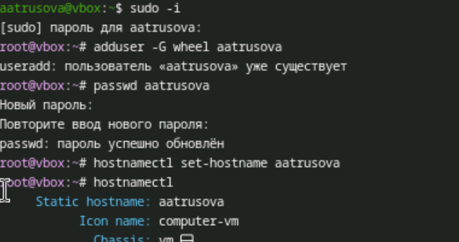{#fig:010 width=70%}

## Установка программного обеспечения для создания документации

Переключилась на роль супер-пользователя и установила pandoc (рис. [-@fig:011]).

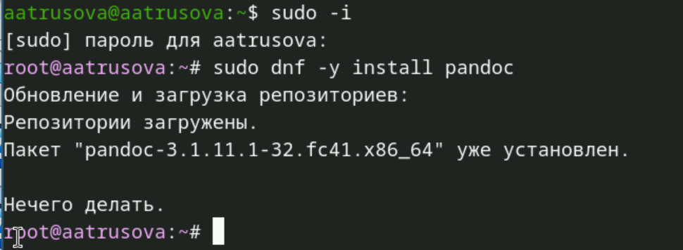{#fig:011 width=70%}

## Установка программного обеспечения для создания документации

Вручную установила нужную версию pandoc-crossref.

Распаковала скачанные архивы и скопировала их в /usr/local/bin (рис. [-@fig:012]).

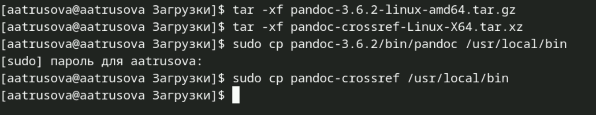{#fig:012 width=70%}

## Установка программного обеспечения для создания документации

Установила дистрибутив TeXlive (рис. [-@fig:013]).

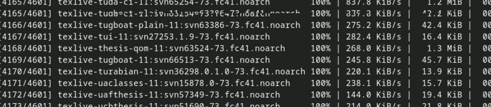{#fig:013 width=70%}

## Домашнее задание 

С помощью команды dmesg | grep -i "то, что ищем" получаю нужную информацию (рис. [-@fig:014]).

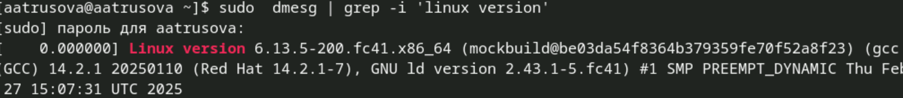{#fig:014 width=70%}

## Домашнее задание 

(рис. [-@fig:015]).

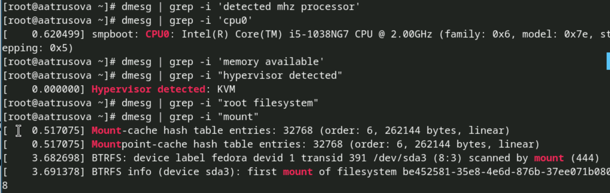{#fig:015 width=70%}

## Контрольные вопросы
	1. Учетная запись пользователя в Linux обычно содержит информацию о пользователе, такую как:
		- Имя пользователя (username)
		- UID (идентификатор пользователя)
		- GID (идентификатор группы)
		- Полное имя
		- Домашний каталог
		- Команда оболочки по умолчанию
	Эта информация хранится в файле /etc/passwd.
	
## Контрольные вопросы

	2. Команды и их применение

		- Получение справки по команде: man <команда>
		- Перемещение по файловой системе: cd <путь к каталогу>
		- Просмотр содержимого каталога: ls <путь к каталогу>
		- Определение объёма каталога: du -sh <путь к каталогу>
		- Создание каталога: mkdir <путь к каталогу>
		- Удаление каталога: rmdir <путь к каталогу>
		- Создание файла: touch <путь к файлу>
		- Задание прав на каталог/файл: chmod <права> <путь к файлу или каталогу>
		- Просмотр истории команд: history
	
## Контрольные вопросы

	3. Файловая система — это способ организации и хранения файлов на устройстве хранения. Она 	определяет, как данные хранятся и извлекаются.
	Примеры файловых систем:
		- ext4: Одна из самых популярных файловых систем для Linux, поддерживает большие 		объемы данных, надежна и масштабируема.

		- Btrfs: Поддерживает функции управления данными, такие как создание снимков и RAID.

		- XFS: Высокопроизводительная файловая система, оптимизированная для работы с 			большими файлами, часто используется в серверах.
		
## Контрольные вопросы

	4. Для проверки, какие файловые системы подмонтированы, можно использовать команду mount.
    	5. Для удаления зависшего процесса сначала нужно найти его PID (идентификатор процесса) с 	помощью команды ps или top:
	ps aux | grep <название_процесса>
	Затем используйте команду kill:
	kill <PID>

# Выводы

Я приобрела практические навыки установки операционной системы на виртуальную машину, настройки минимально необходимых для дальнейшей работы сервисов.

# Список литературы{.unnumbered}

1. [Архитектура компьютеров и операционные системы. Раздел "Операционные системы". Лабораторная работа №1](https://esystem.rudn.ru/mod/page/view.php?id=1224368)
