---
## Front matter
title: "Лабораторная работа №1"
subtitle: "Операционные системы"
author: "Трусова Алина Александровна

## Generic otions
lang: ru-RU
toc-title: "Содержание"

## Bibliography
bibliography: bib/cite.bib
csl: pandoc/csl/gost-r-7-0-5-2008-numeric.csl

## Pdf output format
toc: true # Table of contents
toc-depth: 2
lof: true # List of figures
lot: true # List of tables
fontsize: 12pt
linestretch: 1.5
papersize: a4
documentclass: scrreprt
## I18n polyglossia
polyglossia-lang:
  name: russian
  options:
	- spelling=modern
	- babelshorthands=true
polyglossia-otherlangs:
  name: english
## I18n babel
babel-lang: russian
babel-otherlangs: english
## Fonts
mainfont: IBM Plex Serif
romanfont: IBM Plex Serif
sansfont: IBM Plex Sans
monofont: IBM Plex Mono
mathfont: STIX Two Math
mainfontoptions: Ligatures=Common,Ligatures=TeX,Scale=0.94
romanfontoptions: Ligatures=Common,Ligatures=TeX,Scale=0.94
sansfontoptions: Ligatures=Common,Ligatures=TeX,Scale=MatchLowercase,Scale=0.94
monofontoptions: Scale=MatchLowercase,Scale=0.94,FakeStretch=0.9
mathfontoptions:
## Biblatex
biblatex: true
biblio-style: "gost-numeric"
biblatexoptions:
  - parentracker=true
  - backend=biber
  - hyperref=auto
  - language=auto
  - autolang=other*
  - citestyle=gost-numeric
## Pandoc-crossref LaTeX customization
figureTitle: "Рис."
tableTitle: "Таблица"
listingTitle: "Листинг"
lofTitle: "Список иллюстраций"
lotTitle: "Список таблиц"
lolTitle: "Листинги"
## Misc options
indent: true
header-includes:
  - \usepackage{indentfirst}
  - \usepackage{float} # keep figures where there are in the text
  - \floatplacement{figure}{H} # keep figures where there are in the text
---

# Цель работы

Целью данной работы является приобретение практических навыков установки операционной системы на виртуальную машину, настройки минимально необходимых для дальнейшей работы сервисов.

# Задание

1. Работа с операционной системой после установки
2. Установка программного обеспечения для создания документации
3. Домашнее задание
4. Контрольные вопросы

# Выполнение лабораторной работы

Описываются проведённые действия, в качестве иллюстрации даётся ссылка на иллюстрацию (рис. [-@fig:001]).

{#fig:001 width=70%}

1. Работа с операционной системой после установки

Установила средства разработки (рис. [-@fig:001]).

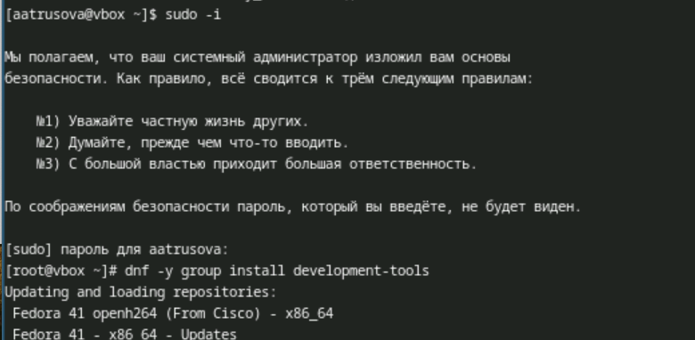{#fig:001 width=70%}

Обновила все пакеты (рис. [-@fig:002]).

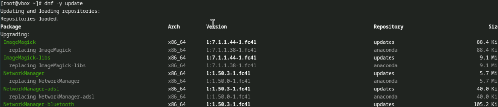{#fig:002 width=70%}

Скачала midnight commander (рис. [-@fig:003]).

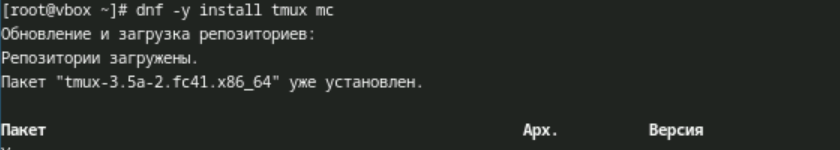{#fig:003 width=70%}

Установила программное обеспечение (рис. [-@fig:004]).

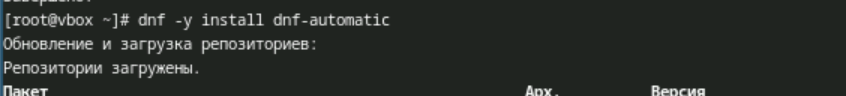{#fig:004 width=70%}

Запустила таймер (рис. [-@fig:005]).

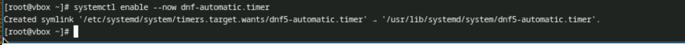{#fig:005 width=70%}

Меняю файл /etc/selinux/config, чтобы отключить selinux (рис. [-@fig:006]).

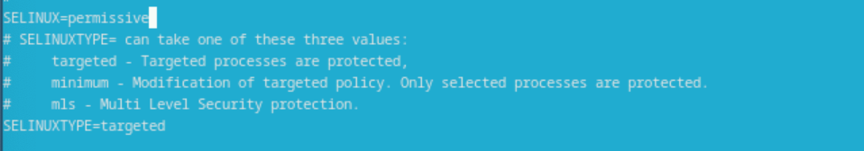{#fig:006 width=70%}

Создала конфигурационный файл ~/.config/sway/config.d/95-system-keyboard-config.conf и открыла его с помощью nano (рис. [-@fig:007]).

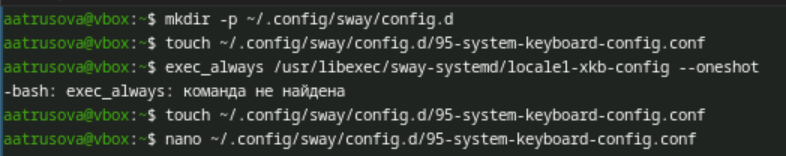{#fig:007 width=70%}

Изменила этот файл (рис. [-@fig:008]).

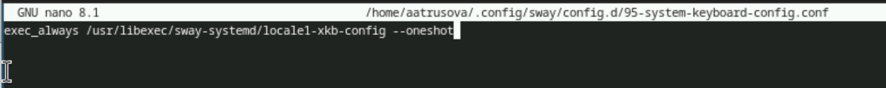{#fig:008 width=70%}

Отредактировала конфигурационный файл /etc/X11/xorg.conf.d/00-keyboard.conf (рис. [-@fig:009]).

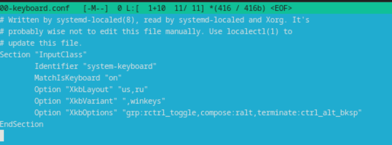{#fig:009 width=70%}

Переключилась на роль супер-пользователя, создала пользователя (он уже существовал), задала для него пароль, установила имя хоста и проверила правильность выполнения (рис. [-@fig:010]).

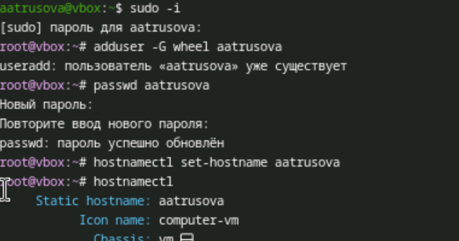{#fig:010 width=70%}

2. Установка программного обеспечения для создания документации

Переключилась на роль супер-пользователя и установила pandoc (рис. [-@fig:011]).

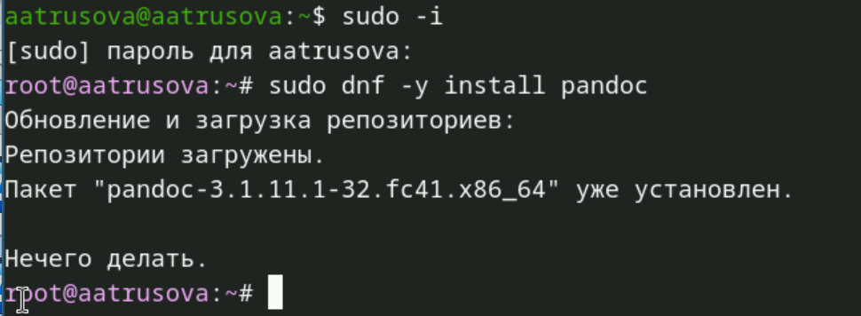{#fig:011 width=70%}

Вручную установила нужную версию pandoc-crossref.

Распаковала скачанные архивы и скопировала их в /usr/local/bin (рис. [-@fig:012]).

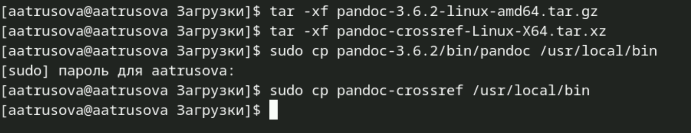{#fig:012 width=70%}

Установила дистрибутив TeXlive (рис. [-@fig:013]).

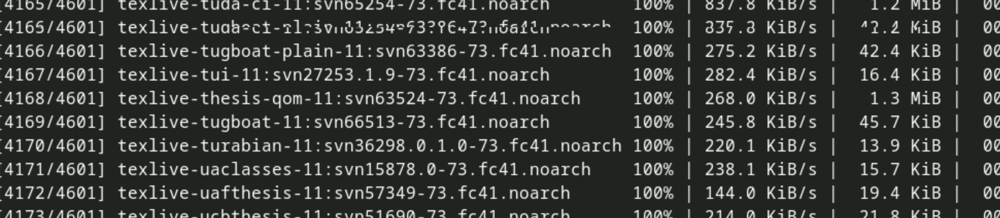{#fig:013 width=70%}

3. Домашнее задание 

С помощью команды dmesg | grep -i "то, что ищем" получаю нужную информацию (рис. [-@fig:014]).

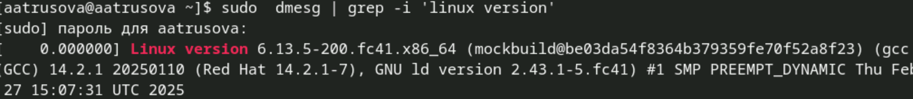{#fig:014 width=70%}

(рис. [-@fig:015]).

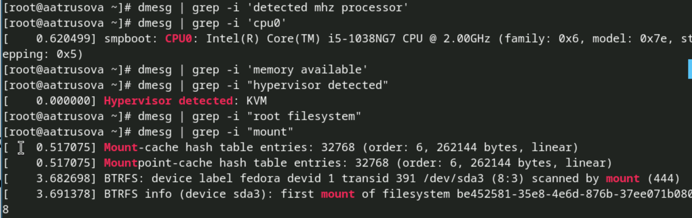{#fig:015 width=70%}

4. Контрольные вопросы
	1. Учетная запись пользователя в Linux обычно содержит информацию о пользователе, такую как:
- Имя пользователя (username)
- UID (идентификатор пользователя)
- GID (идентификатор группы)
- Полное имя
- Домашний каталог
- Команда оболочки по умолчанию
Эта информация хранится в файле /etc/passwd.

# Выводы

Здесь кратко описываются итоги проделанной работы.

# Список литературы{.unnumbered}

::: {#refs}
:::
