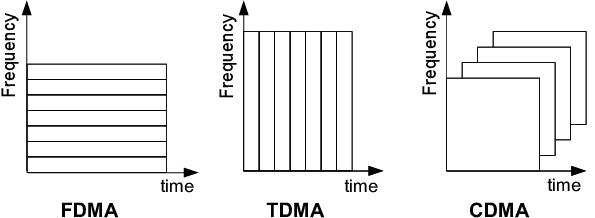

---
## Front matter
lang: ru-RU
title: Сети подвижной связи CDMA
subtitle: Вычислительные системы, сети и телекоммуникации
author:
  - Трусова А. А.
institute:
  - Российский университет дружбы народов, Москва, Россия
date: 21 апреля 2026

## i18n babel
babel-lang: russian
babel-otherlangs: english

## Formatting pdf
toc: false
toc-title: Содержание
slide_level: 2
aspectratio: 169
section-titles: true
theme: metropolis
header-includes:
 - \metroset{progressbar=frametitle,sectionpage=progressbar,numbering=fraction}
---

# Информация

## Докладчик

:::::::::::::: {.columns align=center}
::: {.column width="70%"}

  * Трусова Алина Александровна
  * НКАбд-04-24
  * 1132246715
  * Российский университет дружбы народов
  * [1132246715@rudn.ru](mailto:1132246715@rudn.ru)

:::
::: {.column width="30%"}

:::
::::::::::::::

## Содержание

* Что такое CDMA?
* Как это работает?
* Плюсы и минусы
* Где это сейчас?

# Определение

CDMA (Code Division Multiple Access) — «множественный доступ с кодовым разделением».
Это технология связи, при которой каналы передачи имеют общую полосу частот, но разные кодирующие последовательности.

## Историческая справка

* 1989 г. — публичная демонстрация цифровой сотовой системы на базе CDMA 
* 1993 г. — принятие стандарта IS-95 (cdmaOne) как первого коммерческого стандарта 2G на основе CDMA
* 1995 г. — запуск первой коммерческой сети в Гонконге

## Принцип работы технологии

1. Передача: сигнал абонента «размазывается» по широкой полосе частот с использованием индивидуального кода.
2. Приём: базовая станция, зная код конкретного пользователя, выделяет его сигнал из общей «какофонии» путём корреляционной обработки 
3. Помехоустойчивость: посторонние сигналы (включая сигналы других абонентов) воспринимаются как шум и подавляются.

# Преимущества и недостатки

## Преимущества технологии

| Преимущество | Описание |
|------------------------|----------|
| **Высокая ёмкость** | В одном частотном канале может работать в 4–5 раз больше абонентов, чем в GSM |
| **Помехоустойчивость** | Шумоподобная структура сигнала делает систему устойчивой к узкополосным помехам и перехвату |

## Преимущества технологии

| Преимущество | Описание |
|------------------------|----------|
| **Качество речи** | Использование адаптивных кодеков (13 кбит/с) и технологии мягкого переключения (soft handoff) |
| **Энергоэффективность** | Низкая пиковая мощность излучения (до 250 мВт) продлевает время работы батареи |

## Преимущества технологии

| Преимущество | Описание |
|------------------------|----------|
| **Гибкость ресурсов** | Нет жёсткого лимита каналов: при росте нагрузки качество плавно снижается |

## Недостатки

| Недостаток | Описание |
|------------------------|----------|
| **Сложность реализации** | Требуются мощные процессоры для обработки сигналов в реальном времени |
| **Зависимость от синхронизации** | Сбои в системе синхронизации (GPS) могут нарушить работу всей сети |
| **Ограниченная совместимость** | Меньшее глобальное покрытие по сравнению с GSM |

## Применение технологии сегодня

| Где используется | Почему именно здесь |
|-----------------|-------------------|
| **Спутниковая навигация** (GPS, ГЛОНАСС) | Все спутники вещают на одной частоте; приёмник выделяет каждый сигнал по уникальному коду |
| **3G сети (UMTS / W-CDMA)** | Прямая эволюция CDMA; ещё работает в ряде стран как резерв покрытия |

## Применение технологии сегодня

| Где используется | Почему именно здесь |
|-----------------|-------------------|
| **Военная и защищённая связь** | Сигнал похож на шум — сложно обнаружить и заглушить без знания кода |
| **Спутниковая связь** (Iridium, Inmarsat) | Устойчивость к помехам и отражениям сигнала в сложных условиях |
| **Элементы 4G/5G** | Отдельные механизмы (управление мощностью, кодовые пилоты) унаследованы от CDMA |

# Заключение

Технология CDMA стала важным этапом в развитии мобильной связи. Она доказала эффективность кодового разделения каналов, обеспечила качественный скачок в ёмкости и защищённости сетей. Хотя сегодня доминируют стандарты на основе OFDMA (LTE, 5G), принципы CDMA продолжают использоваться в гибридных решениях и остаются актуальными для специализированных систем связи.
