---
## Front matter
title: "Отчёт по лабораторной работе №2"
subtitle: "Операционные системы"
author: "Трусова Алина Александровна"

## Generic otions
lang: ru-RU
toc-title: "Содержание"

## Bibliography
bibliography: bib/cite.bib
csl: pandoc/csl/gost-r-7-0-5-2008-numeric.csl

## Pdf output format
toc: true # Table of contents
toc-depth: 2
lof: true # List of figures
lot: true # List of tables
fontsize: 12pt
linestretch: 1.5
papersize: a4
documentclass: scrreprt
## I18n polyglossia
polyglossia-lang:
  name: russian
  options:
	- spelling=modern
	- babelshorthands=true
polyglossia-otherlangs:
  name: english
## I18n babel
babel-lang: russian
babel-otherlangs: english
## Fonts
mainfont: IBM Plex Serif
romanfont: IBM Plex Serif
sansfont: IBM Plex Sans
monofont: IBM Plex Mono
mathfont: STIX Two Math
mainfontoptions: Ligatures=Common,Ligatures=TeX,Scale=0.94
romanfontoptions: Ligatures=Common,Ligatures=TeX,Scale=0.94
sansfontoptions: Ligatures=Common,Ligatures=TeX,Scale=MatchLowercase,Scale=0.94
monofontoptions: Scale=MatchLowercase,Scale=0.94,FakeStretch=0.9
mathfontoptions:
## Biblatex
biblatex: true
biblio-style: "gost-numeric"
biblatexoptions:
  - parentracker=true
  - backend=biber
  - hyperref=auto
  - language=auto
  - autolang=other*
  - citestyle=gost-numeric
## Pandoc-crossref LaTeX customization
figureTitle: "Рис."
tableTitle: "Таблица"
listingTitle: "Листинг"
lofTitle: "Список иллюстраций"
lotTitle: "Список таблиц"
lolTitle: "Листинги"
## Misc options
indent: true
header-includes:
  - \usepackage{indentfirst}
  - \usepackage{float} # keep figures where there are in the text
  - \floatplacement{figure}{H} # keep figures where there are in the text
---

# Цель работы

1. Изучить идеологию и применение средств контроля версий.
2. Освоить умения по работе с git.

# Задание

1. Установка программного обеспечения
2. Базовая настройка git
3. Создание ключей ssh
4. Создание ключей pgp
5. Добавление pgp ключа в github
6. Настройка автоматических подписей коммитов git
7. Настройка gh
8. Создание шаблона для рабочего пространства
9. Настройка каталога курса
10. Контрольные вопросы

# Теоретическое введение

Системы контроля версий (Version Control System, VCS) применяются при работе нескольких человек над одним проектом. Обычно основное дерево проекта хранится в локальном или удалённом репозитории, к которому настроен доступ для участников проекта. При внесении изменений в содержание проекта система контроля версий позволяет их фиксировать, совмещать изменения, произведённые разными участниками проекта, производить откат к любой более ранней версии проекта, если это требуется.

В классических системах контроля версий используется централизованная модель, предполагающая наличие единого репозитория для хранения файлов. Выполнение большинства функций по управлению версиями осуществляется специальным сервером. Участник проекта (пользователь) перед началом работы посредством определённых команд получает нужную ему версию файлов. После внесения изменений, пользователь размещает новую версию в хранилище. При этом предыдущие версии не удаляются из центрального хранилища и к ним можно вернуться в любой момент. Сервер может сохранять не полную версию изменённых файлов, а производить так называемую дельта-компрессию — сохранять только изменения между последовательными версиями, что позволяет уменьшить объём хранимых данных.

Системы контроля версий поддерживают возможность отслеживания и разрешения конфликтов, которые могут возникнуть при работе нескольких человек над одним файлом. Можно объединить (слить) изменения, сделанные разными участниками (автоматически или вручную), вручную выбрать нужную версию, отменить изменения вовсе или заблокировать файлы для изменения. В зависимости от настроек блокировка не позволяет другим пользователям получить рабочую копию или препятствует изменению рабочей копии файла средствами файловой системы ОС, обеспечивая таким образом, привилегированный доступ только одному пользователю, работающему с файлом.

Системы контроля версий также могут обеспечивать дополнительные, более гибкие функциональные возможности. Например, они могут поддерживать работу с несколькими версиями одного файла, сохраняя общую историю изменений до точки ветвления версий и собственные истории изменений каждой ветви. Кроме того, обычно доступна информация о том, кто из участников, когда и какие изменения вносил. Обычно такого рода информация хранится в журнале изменений, доступ к которому можно ограничить.

В отличие от классических, в распределённых системах контроля версий центральный репозиторий не является обязательным.

Среди классических VCS наиболее известны CVS, Subversion, а среди распределённых — Git, Bazaar, Mercurial. Принципы их работы схожи, отличаются они в основном синтаксисом используемых в работе команд.

##Примеры использования git

1. Система контроля версий Git представляет собой набор программ командной строки. Доступ к ним можно получить из терминала посредством ввода команды git с различными опциями.
2. Благодаря тому, что Git является распределённой системой контроля версий, резервную копию локального хранилища можно сделать простым копированием или архивацией.

# Выполнение лабораторной работы

##1. Установка программного обеспечения

Установила git и gh (рис. [-@fig:001]).

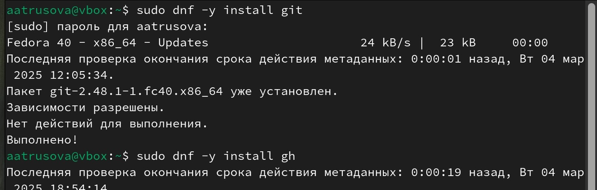{#fig:001 width=70%}

##2. Базовая настройка git

Задала имя и email владельца репозитория, настроила utf-8 в выводе сообщений git, задала имя начальной ветки и назвала её master, добавила параметры autocrlf и safecrlf (рис. [-@fig:002]).

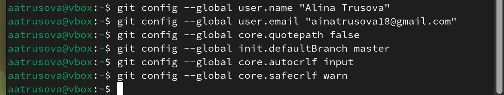{#fig:002 width=70%}

##3. Создание ключа ssh

Создала ключ по алгоритму rsa с ключом размером 4096 бит (рис. [-@fig:003]).

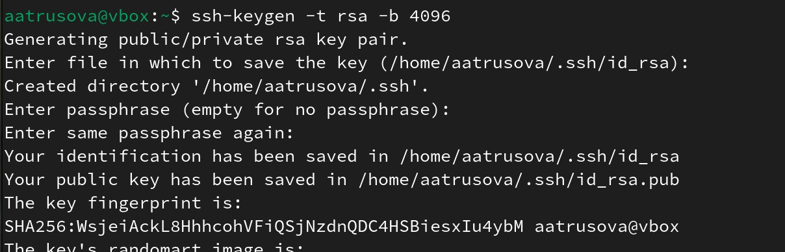{#fig:003 width=70%}

##4. Создание ключа pgp

Создала ключ с нужными параметрами (рис. [-@fig:004]).

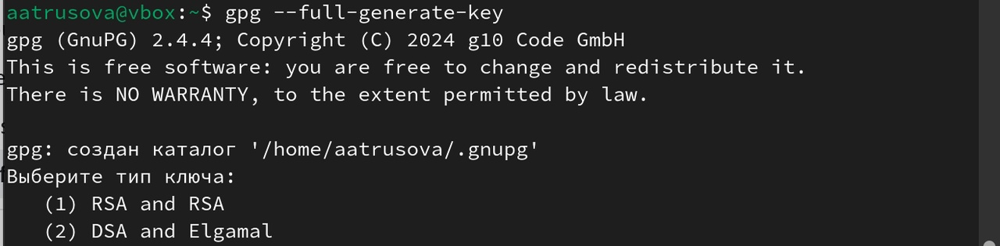{#fig:004 width=70%}

##5. Добавление pgp ключа в github

Вывела список ключей и скопировала отпечаток приватного ключа (рис. [-@fig:005]).

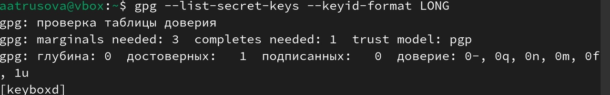{#fig:005 width=70%}

Вывела сгенерированный ключ и скопировала его в буфер обмена (рис. [-@fig:006]).

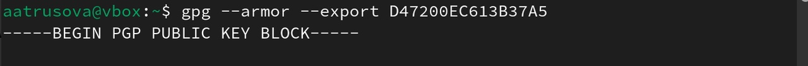{#fig:006 width=70%}

Добавила новый ключ gpg на github (рис. [-@fig:007]).

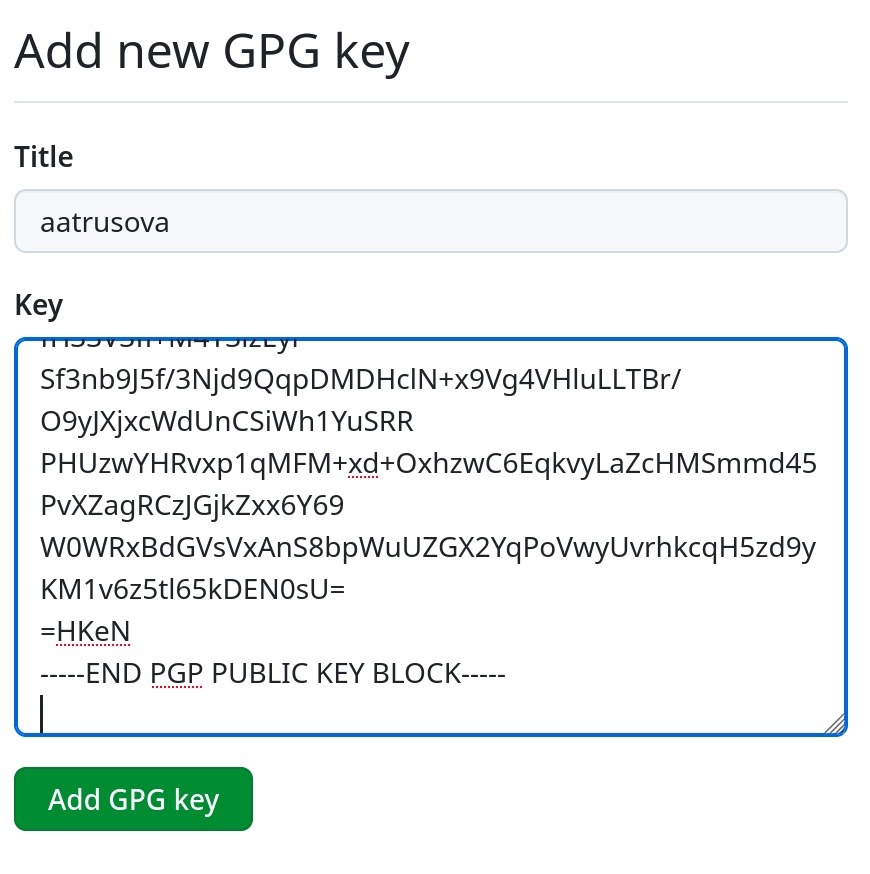{#fig:007 width=70%}

##6. Настройка автоматических подписей коммитов git

Указала git применять введённый email для подписи коммитов (рис. [-@fig:008]).

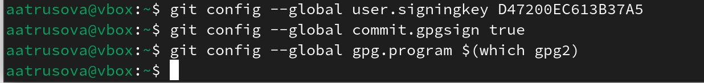{#fig:008 width=70%}

##7. Настройка gh

Авторизовалась на гитхабе (рис. [-@fig:009]).

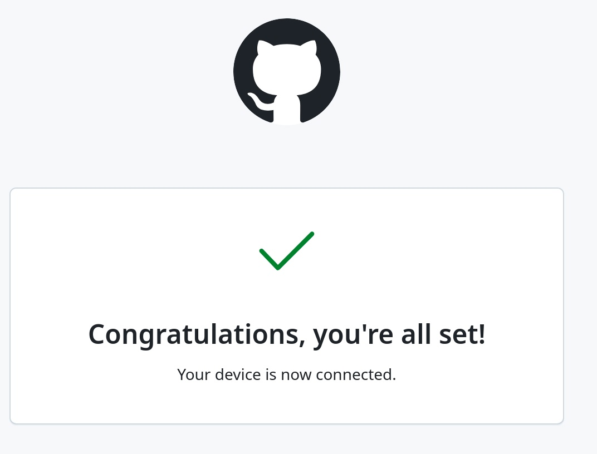{#fig:009 width=70%}

##8. Создание шаблона рабочего пространства

Создала рабочее пространство по шаблону (рис. [-@fig:010]).

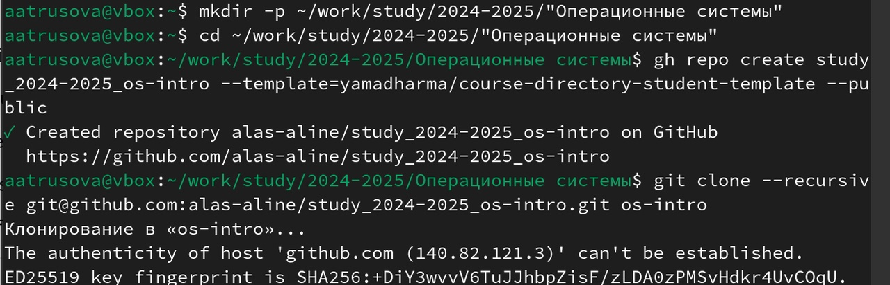{#fig:010 width=70%}

##9. Настройка каталога курса

Перешла в каталог курса, удалила лишние файлы и создала новые (рис. [-@fig:011]).

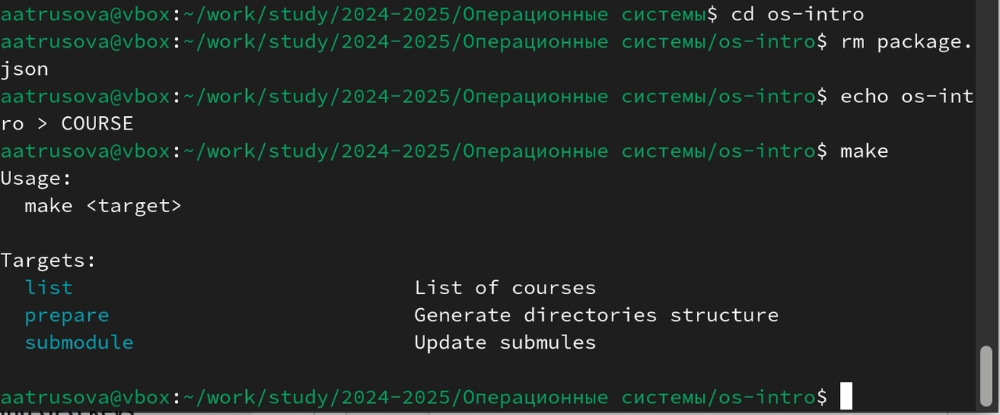{#fig:011 width=70%}

Прописала коммит (рис. [-@fig:012]).

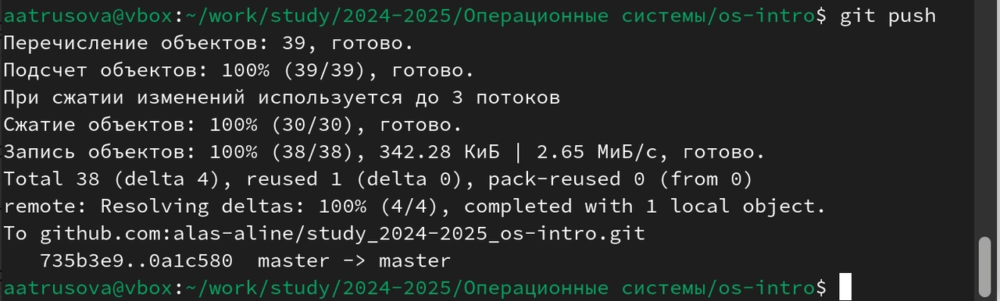{#fig:012 width=70%}

Отправила изменения на репозиторий (рис. [-@fig:013]).

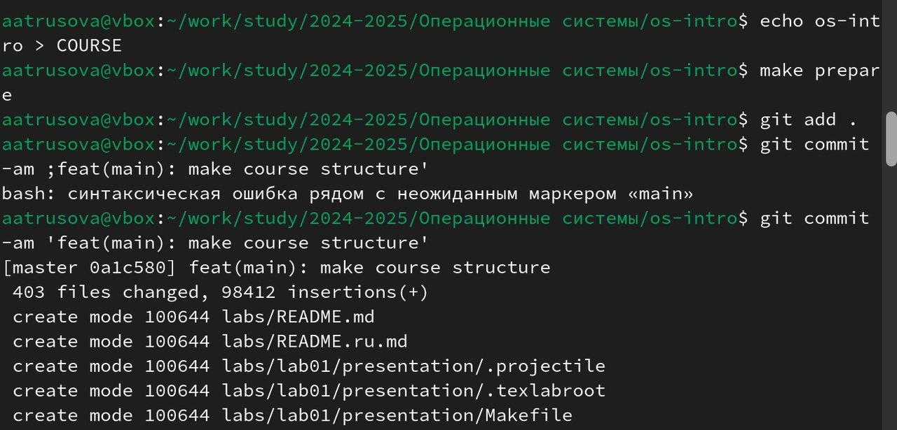{#fig:013 width=70%}

# Выводы

Я изучила идеологию и применение средств контроля версий и освоила умения по работе с git.

# Список литературы{.unnumbered}

1. Архитектура компьютеров и операционные системы. Раздел "Операционные системы". "Лабораторная работа №2" https://esystem.rudn.ru/mod/page/view.php?id=1224371
