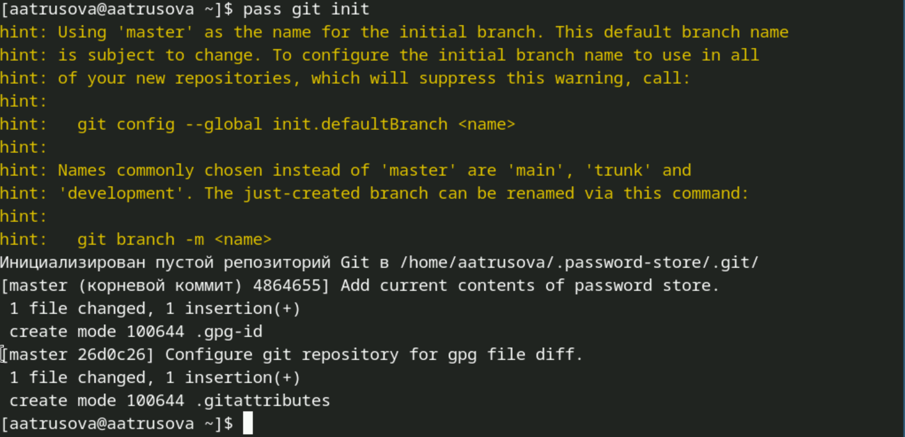

---
## Front matter
lang: ru-RU
title: Лабораторная работа №5
subtitle: Операционные системы
author:
  - Трусова А. А.
institute:
  - Российский университет дружбы народов, Москва, Россия
date: 15 марта 2025

## i18n babel
babel-lang: russian
babel-otherlangs: english

## Formatting pdf
toc: false
toc-title: Содержание
slide_level: 2
aspectratio: 169
section-titles: true
theme: metropolis
header-includes:
 - \metroset{progressbar=frametitle,sectionpage=progressbar,numbering=fraction}
---

# Информация

## Докладчик

  * Трусова Алина Александровна
  * НКАбд-05-24, студ. билет №1132246715
  * Российский университет дружбы народов
  * <https://github.com/alas-aline/study_2024-2025_os-intro>

# Вводная часть

## Цель

Получить навыки работы с менеджером паролей pass, native messaging, chezmoi. Научиться пользоваться этими утилитами и сонхронизировать их с git.

## Задачи

1. Работа с менеджером паролей pass.
2. Управление файлами конфигурации.

# Теоретическое введение

Менеджер паролей pass:
- Менеджер паролей pass — программа, сделанная в рамках идеологии Unix.
- Также носит название стандартного менеджера паролей для Unix (The standard Unix password manager).

Основные свойства:
- Данные хранятся в файловой системе в виде каталогов и файлов.
- Файлы шифруются с помощью GPG-ключа.

# Выполнение лабораторной работы

## Работа с менеджером паролей pass

Устанавливаю менеджер паролей pass (рис. [-@fig:001]).

{#fig:001 width=70%}

## Работа с менеджером паролей pass

Просматриваю список ключей gpg. У меня есть старый, поэтому использую его (рис. [-@fig:002]).

{#fig:002 width=70%}

## Работа с менеджером паролей pass

Инициализирую хранилище по электронной почте (рис. [-@fig:003]).

{#fig:003 width=70%}

## Работа с менеджером паролей pass

Создала структуру git (рис. [-@fig:004]).

{#fig:004 width=70%}

## Работа с менеджером паролей pass

На гитхаб создала новый тестовый репозиторий (рис. [-@fig:005]).

{#fig:005 width=70%}

## Работа с менеджером паролей pass

После задаю адрес этого репозитория (рис. [-@fig:006]).

{#fig:006 width=70%}

## Работа с менеджером паролей pass

Вручную закоммитила и выложила изменения (хотя их не было) (рис. [-@fig:007])

{#fig:007 width=70%}

## Работа с менеджером паролей pass

И проверила статус синхронизации (рис. [-@fig:008]).

{#fig:008 width=70%}

## Работа с менеджером паролей pass

Скачала плагин Browserpass для Firefox (рис. [-@fig:009]).

{#fig:009 width=70%}

## Работа с менеджером паролей pass

Установила интерфейс для взаимодействия с браузером (рис. [-@fig:010]).

{#fig:010 width=70%}

## Работа с менеджером паролей pass

Сохраняю пароль и проверяю изменения (рис. [-@fig:011]).

{#fig:011 width=70%}

## Работа с менеджером паролей pass

Заменя существуеющий пароль рандомным (рис. [-@fig:012]).

{#fig:012 width=70%}

## Управление файлами конфигурации 

Устанавливаю дополнительное программное обеспечение (оно уже было установлено) (рис. [-@fig:013]).

{#fig:013 width=70%}

## Управление файлами конфигурации 

Устанавливаю шрифты (рис. [-@fig:014])

{#fig:014 width=70%}

## Управление файлами конфигурации 

И ещё устанавливаю шрифты (рис. [-@fig:015]).

{#fig:015 width=70%}

## Управление файлами конфигурации 

Устанавливаю бинарный файл, создаю свой репозиторий для конфигурационных файлов на основе шаблона и инициализирую chezmoi с этим репозиторием  (рис. [-@fig:016]).

{#fig:016 width=70%}

## Управление файлами конфигурации 

Проверяю, какие изменения внесёт chezmoi (рис. [-@fig:017]).

{#fig:017 width=70%}

## Управление файлами конфигурации 

Решив, что изменения меня устраивают, запускаю chezmoi apply -v (это была ошибка).

На другой машине инициализирую chezmoi с репозиторием dotfiles, предварительно скачав chezmoi (рис. [-@fig:018]).

{#fig:018 width=70%}

## Управление файлами конфигурации 

По аналогии проверяю, какие изменения внесёт chezmoi и запускаю chezmoi apply -v.

Извлекаю изменения из репозитория дважды с помощью разных команд (ничего не изменилось) и применяю изменения (которых не было) (рис. [-@fig:019]).

{#fig:019 width=70%}

## Управление файлами конфигурации 

Хотела изменить файл конфигурации, чтобы изменения отправлялись в репозиторий автоматически, но он уже был настроен нужным образом (рис. [-@fig:020]).

{#fig:020 width=70%}

# Выводы

Я получила навыки работы с менеджером паролей pass, native messaging, chezmoi, научилась пользоваться этими утилитами и сонхронизировать их с git.
