---
## Front matter
title: "Лабораторная работа №5"
subtitle: "Операционные системы"
author: "Трусова Алина Александровна"

## Generic otions
lang: ru-RU
toc-title: "Содержание"

## Bibliography
bibliography: bib/cite.bib
csl: pandoc/csl/gost-r-7-0-5-2008-numeric.csl

## Pdf output format
toc: true # Table of contents
toc-depth: 2
lof: true # List of figures
lot: true # List of tables
fontsize: 12pt
linestretch: 1.5
papersize: a4
documentclass: scrreprt
## I18n polyglossia
polyglossia-lang:
  name: russian
  options:
	- spelling=modern
	- babelshorthands=true
polyglossia-otherlangs:
  name: english
## I18n babel
babel-lang: russian
babel-otherlangs: english
## Fonts
mainfont: IBM Plex Serif
romanfont: IBM Plex Serif
sansfont: IBM Plex Sans
monofont: IBM Plex Mono
mathfont: STIX Two Math
mainfontoptions: Ligatures=Common,Ligatures=TeX,Scale=0.94
romanfontoptions: Ligatures=Common,Ligatures=TeX,Scale=0.94
sansfontoptions: Ligatures=Common,Ligatures=TeX,Scale=MatchLowercase,Scale=0.94
monofontoptions: Scale=MatchLowercase,Scale=0.94,FakeStretch=0.9
mathfontoptions:
## Biblatex
biblatex: true
biblio-style: "gost-numeric"
biblatexoptions:
  - parentracker=true
  - backend=biber
  - hyperref=auto
  - language=auto
  - autolang=other*
  - citestyle=gost-numeric
## Pandoc-crossref LaTeX customization
figureTitle: "Рис."
tableTitle: "Таблица"
listingTitle: "Листинг"
lofTitle: "Список иллюстраций"
lotTitle: "Список таблиц"
lolTitle: "Листинги"
## Misc options
indent: true
header-includes:
  - \usepackage{indentfirst}
  - \usepackage{float} # keep figures where there are in the text
  - \floatplacement{figure}{H} # keep figures where there are in the text
---

# Цель работы

Получить навыки работы с менеджером паролей pass.

# Задание

1. Работа с менеджером паролей pass.
2. Управление файлами конфигурации.

# Теоретическое введение

Менеджер паролей pass:
- Менеджер паролей pass — программа, сделанная в рамках идеологии Unix.
- Также носит название стандартного менеджера паролей для Unix (The standard Unix password manager).

Основные свойства:
- Данные хранятся в файловой системе в виде каталогов и файлов.
- Файлы шифруются с помощью GPG-ключа.

# Выполнение лабораторной работы

## Работа с менеджером паролей pass

Устанавливаю менеджер паролей pass (рис. [-@fig:001]).

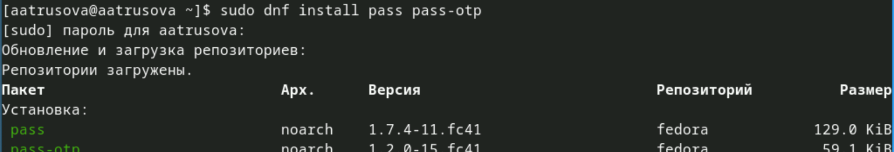{#fig:001 width=70%}

Просматриваю список ключей gpg. У меня есть старый, поэтому использую его (рис. [-@fig:002]).

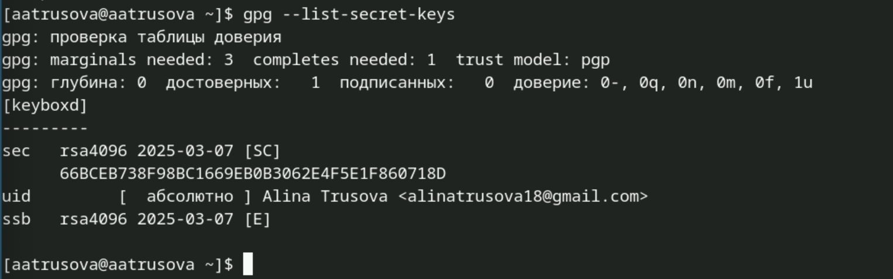{#fig:002 width=70%}

Инициализирую хранилище по электронной почте (рис. [-@fig:003]).

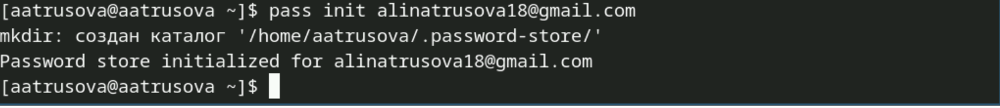{#fig:003 width=70%}

Создала структуру git (рис. [-@fig:004]).

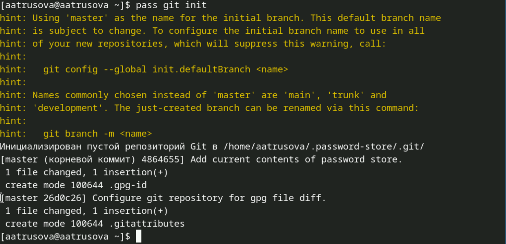{#fig:004 width=70%}

На гитхаб создала новый тестовый репозиторий (рис. [-@fig:005]).

{#fig:005 width=70%}

После задаю адрес этого репозитория (рис. [-@fig:006]).

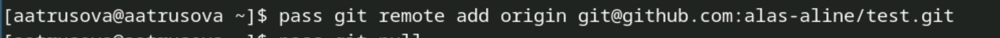{#fig:006 width=70%}

Вручную закоммитила и выложила изменения (хотя их не было) (рис. [-@fig:007])

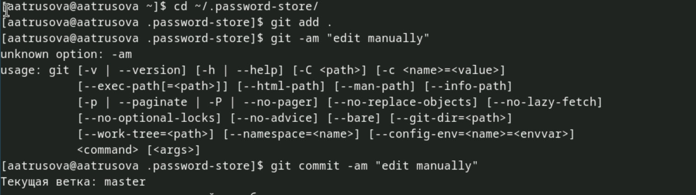{#fig:007 width=70%}

И проверила статус синхронизации (рис. [-@fig:008]).

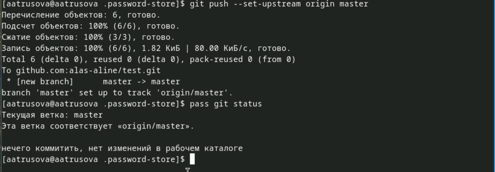{#fig:008 width=70%}

Скачала плагин Browserpass для Firefox (рис. [-@fig:009]).

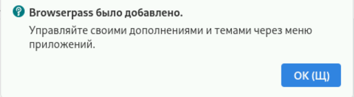{#fig:009 width=70%}

Установила интерфейс для взаимодействия с браузером (рис. [-@fig:010]).

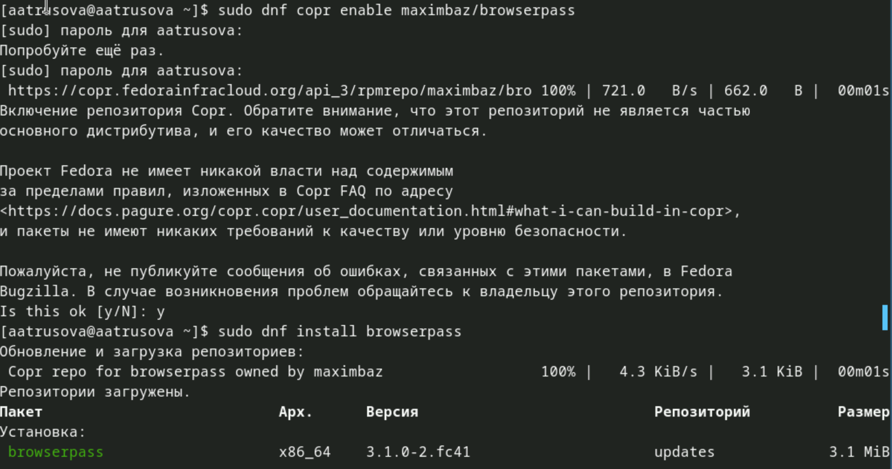{#fig:010 width=70%}

Сохраняю пароль и проверяю изменения (рис. [-@fig:011]).

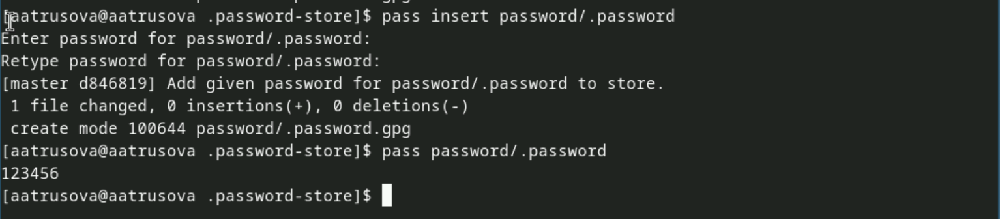{#fig:011 width=70%}

Заменя существуеющий пароль рандомным (рис. [-@fig:012]).

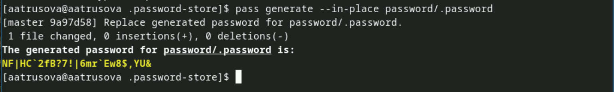{#fig:012 width=70%}

## Управление файлами конфигурации 

Устанавливаю дополнительное программное обеспечение (оно уже было установлено) (рис. [-@fig:013]).

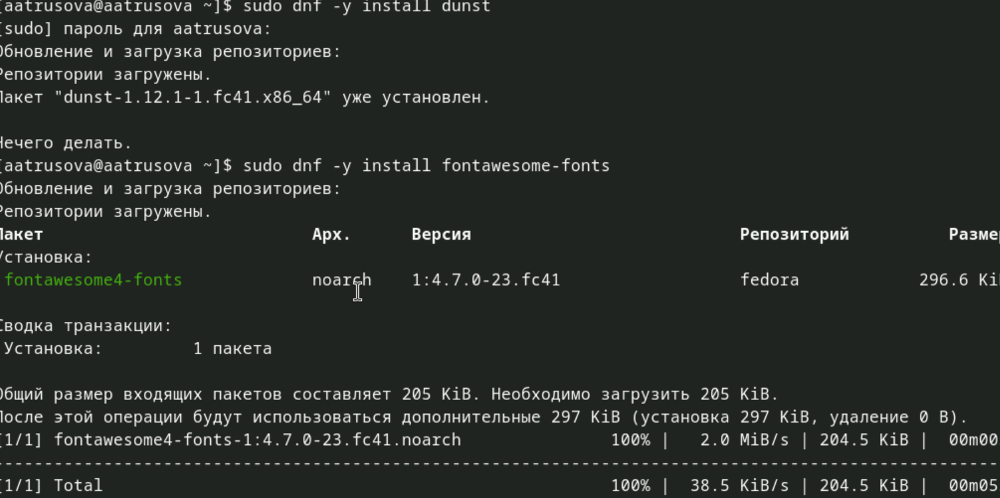{#fig:013 width=70%}

Устанавливаю шрифты (рис. [-@fig:014])

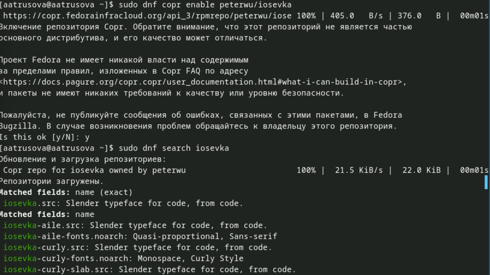{#fig:014 width=70%}

И ещё устанавливаю шрифты (рис. [-@fig:015]).

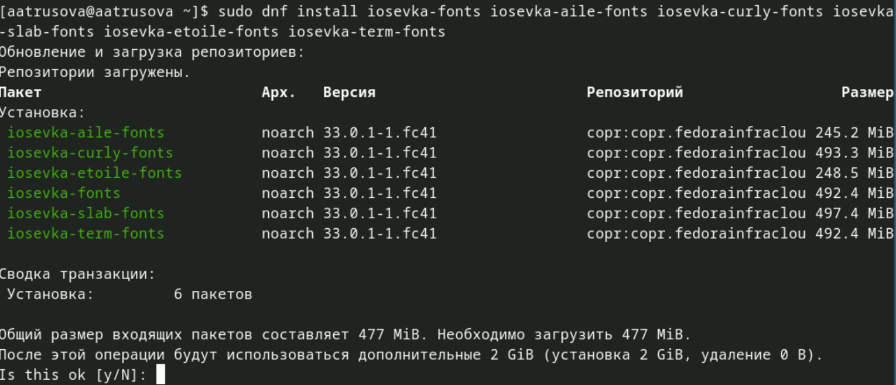{#fig:015 width=70%}

Устанавливаю бинарный файл, создаю свой репозиторий для конфигурационных файлов на основе шаблона и инициализирую chezmoi с этим репозиторием  (рис. [-@fig:016]).

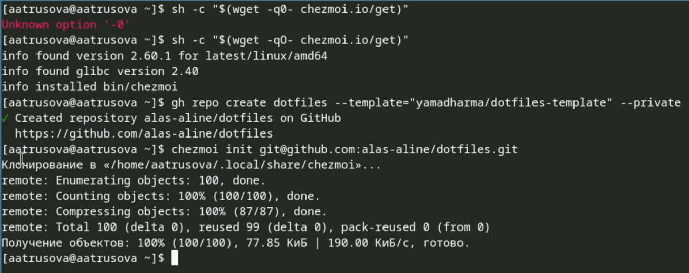{#fig:016 width=70%}

Проверяю, какие изменения внесёт chezmoi (рис. [-@fig:017]).

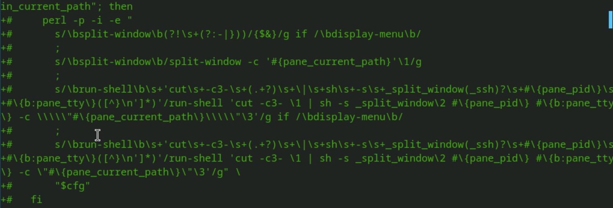{#fig:017 width=70%}

Решив, что изменения меня устраивают, запускаю chezmoi apply -v (это была ошибка).

На другой машине инициализирую chezmoi с репозиторием dotfiles, предварительно скачав chezmoi (рис. [-@fig:018]).

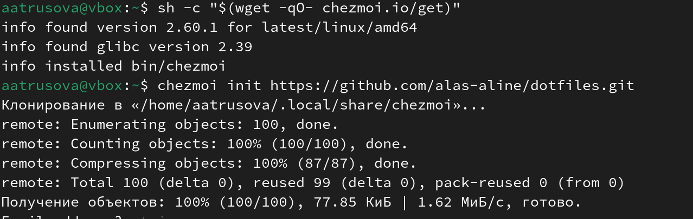{#fig:018 width=70%}

По аналогии проверяю, какие изменения внесёт chezmoi и запускаю chezmoi apply -v.

Извлекаю изменения из репозитория дважды с помощью разных команд (ничего не изменилось) и применяю изменения (которых не было) (рис. [-@fig:019]).

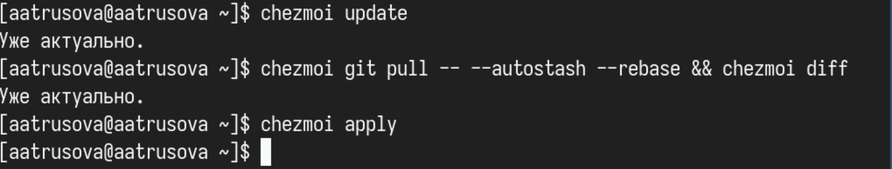{#fig:019 width=70%}

Хотела изменить файл конфигурации, чтобы изменения отправлялись в репозиторий автоматически, но он уже был настроен нужным образом (рис. [-@fig:020]).

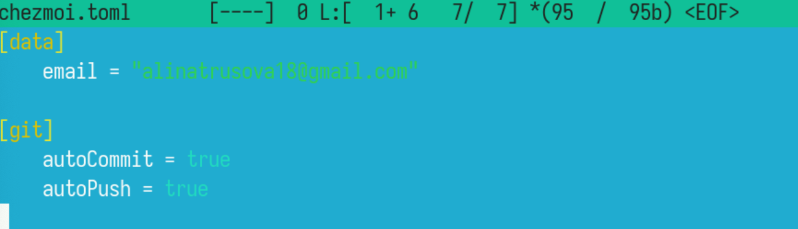{#fig:020 width=70%}

# Выводы

Я получила навыки работы с менеджером паролей pass [@lab].

# Список литературы{.unnumbered}

::: {#refs}
:::
