---
## Front matter
lang: ru-RU
title: Лабораторная работа №6
subtitle: Операционные системы
author:
  - Трусова А. А.
institute:
  - Российский университет дружбы народов, Москва, Россия
date: 21 марта 2025

## i18n babel
babel-lang: russian
babel-otherlangs: english

## Formatting pdf
toc: false
toc-title: Содержание
slide_level: 2
aspectratio: 169
section-titles: true
theme: metropolis
header-includes:
 - \metroset{progressbar=frametitle,sectionpage=progressbar,numbering=fraction}
---

# Информация

## Докладчик

:::::::::::::: {.columns align=center}
::: {.column width="70%"}

  * Трусова Алина Александровна
  * НКАбд-05-24, студ. билет №1132246715
  * Российский университет дружбы народов
  * <https://github.com/alas-aline/study_2024-2025_os-intro>

:::
::: {.column width="30%"}

:::
::::::::::::::

# Вводная часть

## Цель

Приобретение практических навыков взаимодействия пользователя с системой посредством командной строки.

## Задачи

1. Работа с командами pwd, cd и ls.
2. Создание и удаление каталогов.
3. Информация об опциях команды ls.
4. Основные опции команд cd, pwd, mkdir, rmdir, rm.
5. Исполнение нескольких команд из буфера команд.

# Теоретическое введение

В операционной системе типа Linux взаимодействие пользователя с системой обычно осуществляется с помощью командной строки посредством построчного ввода команд. При этом обычно используется командные интерпретаторы языка shell: /bin/sh;/bin/csh; /bin/ksh.

Командой в операционной системе называется записанный по специальным правилам текст (возможно с аргументами), представляющий собой указание на выполнение какой-либо функций (или действий) в операционной системе. Обычно первым словом идёт имя команды, остальной текст — аргументы или опции, конкретизирующие действие. Общий формат команд можно представить следующим образом: <имя_команды><разделитель><аргументы>.

# Выполнение лабораторной работы

## Работа с командами pwd, cd и ls

Определила полное имя домашнего каталога с помощью pwd (рис. [-@fig:001]).

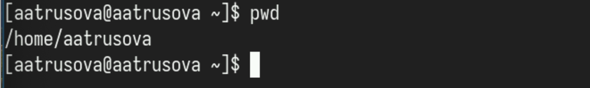{#fig:001 width=70%}

## Работа с командами pwd, cd и ls

Перешла в каталог /tmp и посмотрела его содержимое с помощью ls с различными опциями (рис. [-@fig:002]).

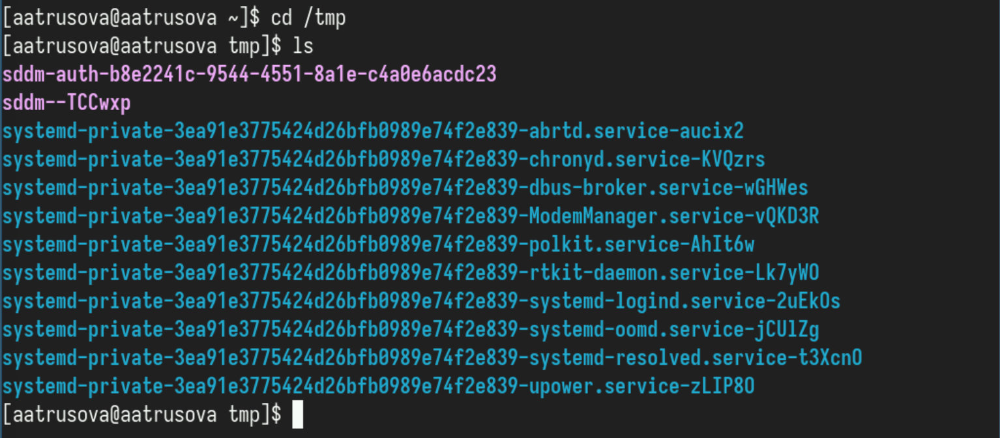{#fig:002 width=70%}

## Работа с командами pwd, cd и ls

Опция -а выводит содержимое каталога, включая скрытые файлы, название которых начинается с "." (рис. [-@fig:003]).

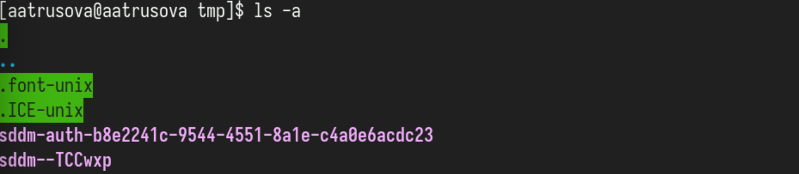{#fig:003 width=70%}

## Работа с командами pwd, cd и ls

Опция --author вместе с -l файлы в каталоге вместе с их автором (рис. [-@fig:004]).

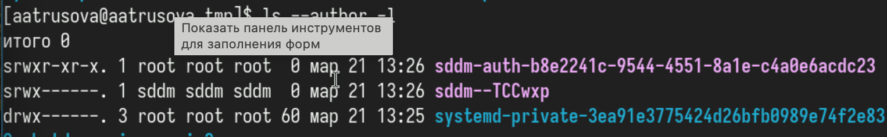{#fig:004 width=70%}

## Работа с командами pwd, cd и ls

Опция -R рекурсивно выводит содержимое каталога и содержимое каталогов внутри него (рис. [-@fig:005]).

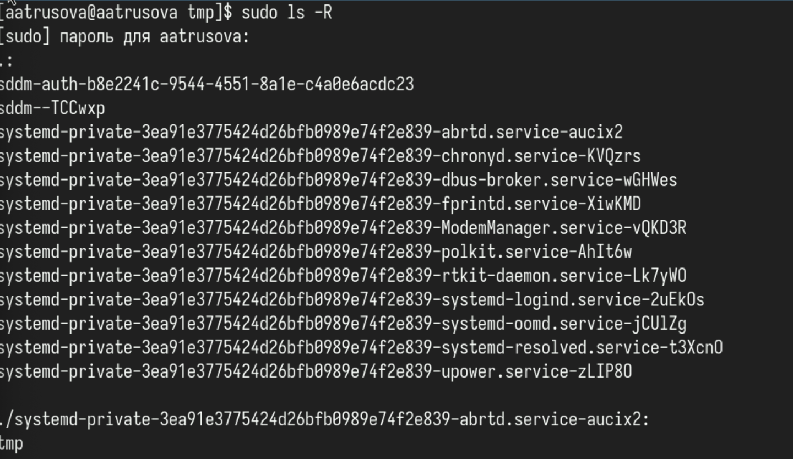{#fig:005 width=70%}

## Работа с командами pwd, cd и ls

Перешла в каталог /var/spool и проверила наличие в нём подкаталога cron (он там был) (рис. [-@fig:006]).

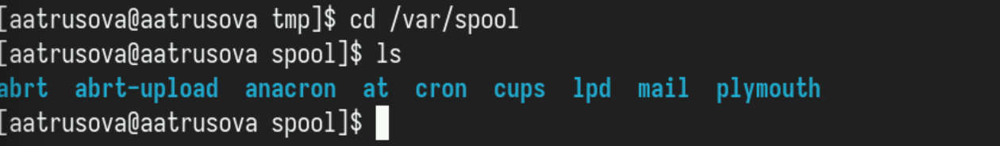{#fig:006 width=70%}

## Работа с командами pwd, cd и ls

Перешла в домашний каталог и проверила, кто является владельцем файлов и подкаталогов (администратор) (рис. [-@fig:007]).

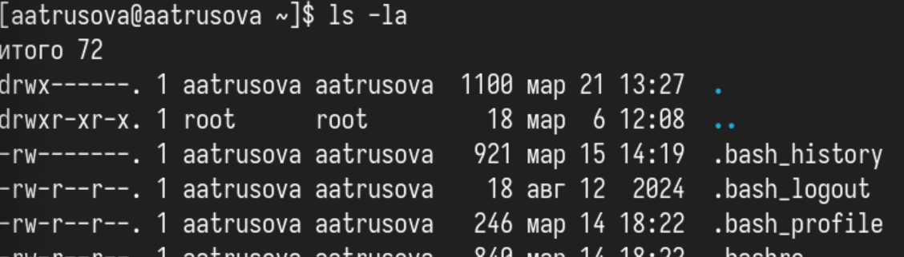{#fig:007 width=70%}

## Создание и удаление каталогов

В домашнем каталоге создала новый каталог и его подкаталог с помощью опции -p (рис. [-@fig:008]).

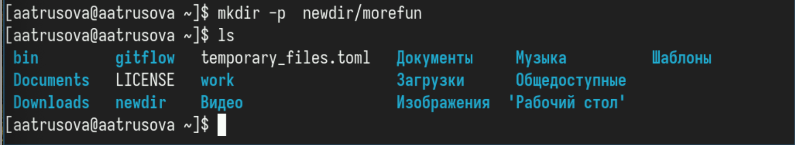{#fig:008 width=70%}

## Создание и удаление каталогов

В домашнем каталоге одной командной создала три каталога, а затем удалила их (рис. [-@fig:009]).

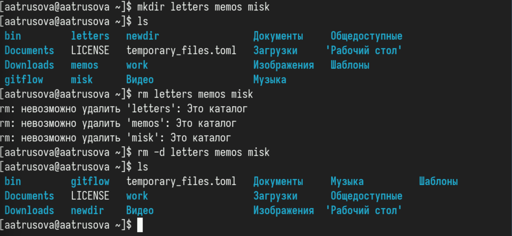{#fig:009 width=70%}

## Создание и удаление каталогов

Попробовала удалить ранее созданный каталог командой rm, не получилось :(. Удалила его с помощью опций -d и -R (рекурсивно, т.к. каталог не пуст) (рис. [-@fig:010]).

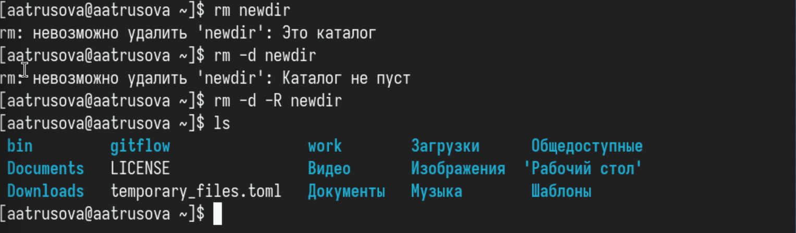{#fig:010 width=70%}

## Информация об опциях команды ls
 
С помощью команды man посмотрела, какую опцию к команде ls нужно использовать, чтобы посмотреть его содержимое рекурсивно (опция -R) (рис. [-@fig:011]).

{#fig:011 width=70%}

## Информация об опциях команды ls

С помощью man определила набор опций команды ls,  позволяющий отсортировать по времени последнего изменения выводимый список содержимого каталога с развёрнутым описанием файлов. Это опция -t (рис. [-@fig:012]).

{#fig:012 width=70%} 

## Информация об опциях команды ls

И опция -l (рис. [-@fig:013]).

{#fig:013 width=70%}

## Основные опции команд cd, pwd, mkdir, rmdir, rm.

Команда cd используется для изменения текущего рабочего каталога.
Основные опции:
..: Переход в родительский каталог.
-: Переход в предыдущий каталог.
~: Переход в домашний каталог пользователя.

## Основные опции команд cd, pwd, mkdir, rmdir, rm.

Команда pwd выводит полный путь к текущему рабочему каталогу.
Основные опции:
-L: Выводит логический путь (по умолчанию).
-P: Выводит физический путь, разрешая символические ссылки.

## Основные опции команд cd, pwd, mkdir, rmdir, rm.

Команда mkdir используется для создания новых каталогов.
Основные опции:
-p: Создаёт промежуточные каталоги, если они не существуют.
-m: Устанавливает права доступа для создаваемого каталога (например, -m 755).

## Основные опции команд cd, pwd, mkdir, rmdir, rm.

Команда rmdir используется для удаления пустых каталогов.
Основные опции:
-p: Удаляет указанный каталог и все его родительские каталоги, если они пустые.

## Основные опции команд cd, pwd, mkdir, rmdir, rm.

Команда rm используется для удаления файлов и каталогов.
Основные опции:
-r: Рекурсивное удаление каталогов и их содержимого.
-f: Принудительное удаление, игнорируя несуществующие файлы и не запрашивая подтверждение.
-i: Запрашивает подтверждение перед удалением каждого файла.
-v: Выводит подробную информацию о процессе удаления.

## Исполнение нескольких команд из буфера команд

С помощью history посмотрела список введённых за сессию команд (рис. [-@fig:014]).

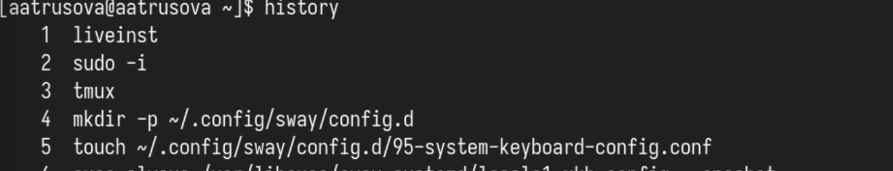{#fig:014 width=70%}

## Исполнение нескольких команд из буфера команд

Выполнила несколько команд из буфера команд (рис. [-@fig:015]).

{#fig:015 width=70%}

## Исполнение нескольких команд из буфера команд

И ещё (рис. [-@fig:016]).

{#fig:016 width=70%}

# Выводы

Я приобрела практические навыки взаимодействия пользователя с системой посредством командной строки.

