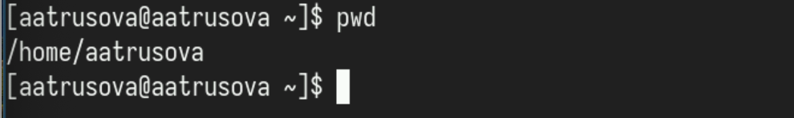
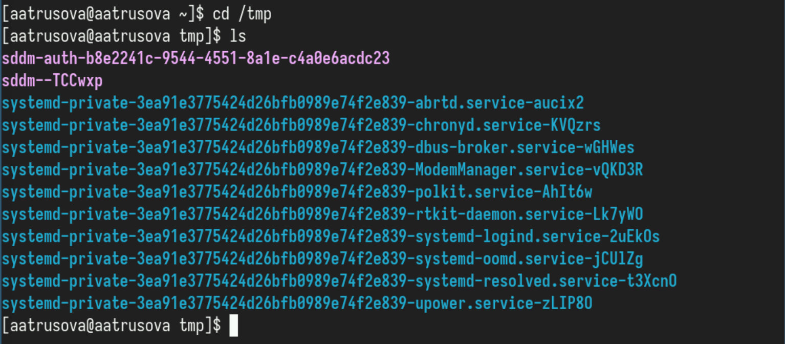
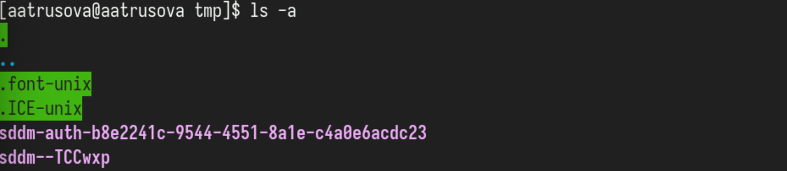
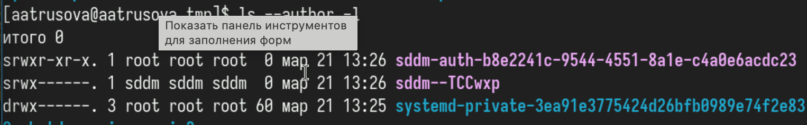
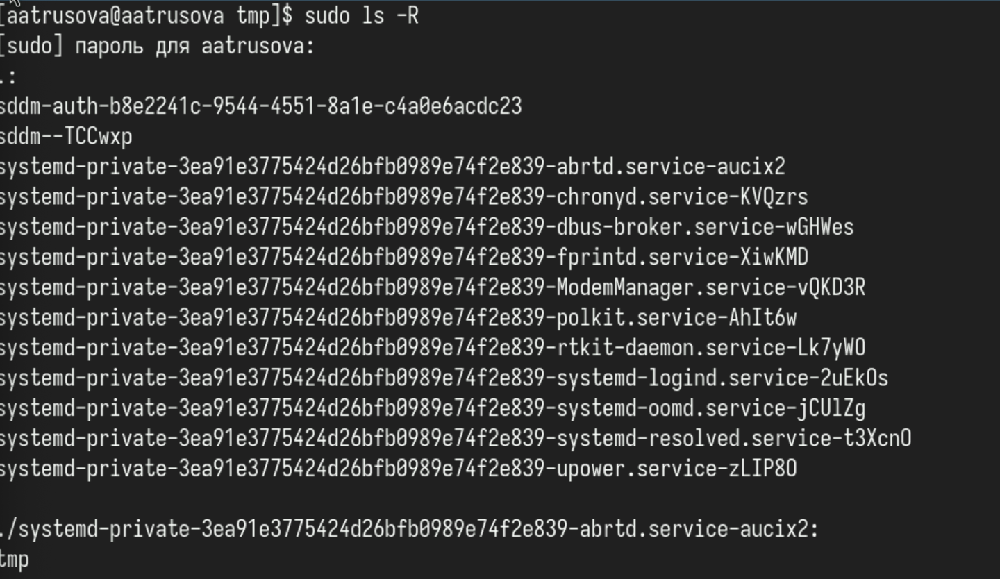
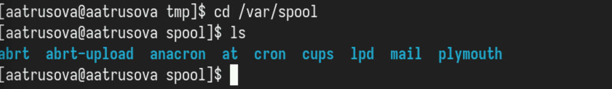
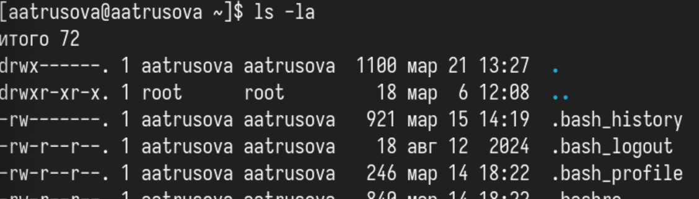
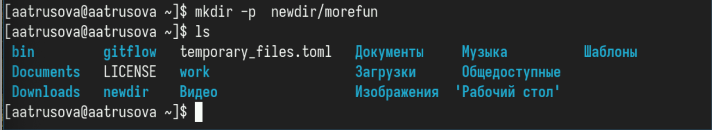
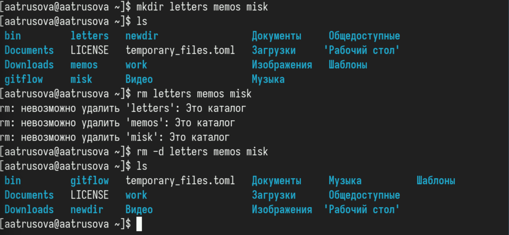
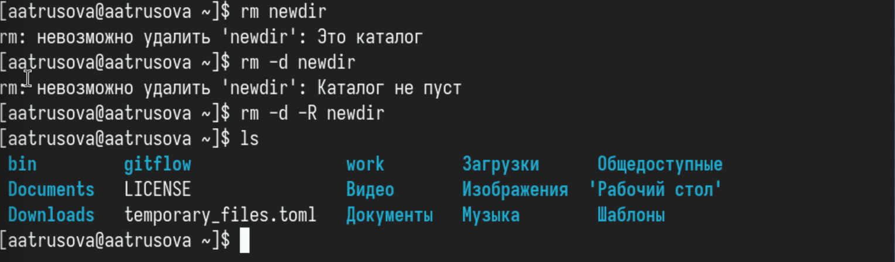

---
## Front matter
title: "Лабораторная работа №6"
subtitle: "Операционные системы"
author: "Трусова Алина Александровна"

## Generic otions
lang: ru-RU
toc-title: "Содержание"

## Bibliography
bibliography: bib/cite.bib
csl: pandoc/csl/gost-r-7-0-5-2008-numeric.csl

## Pdf output format
toc: true # Table of contents
toc-depth: 2
lof: true # List of figures
lot: true # List of tables
fontsize: 12pt
linestretch: 1.5
papersize: a4
documentclass: scrreprt
## I18n polyglossia
polyglossia-lang:
  name: russian
  options:
	- spelling=modern
	- babelshorthands=true
polyglossia-otherlangs:
  name: english
## I18n babel
babel-lang: russian
babel-otherlangs: english
## Fonts
mainfont: IBM Plex Serif
romanfont: IBM Plex Serif
sansfont: IBM Plex Sans
monofont: IBM Plex Mono
mathfont: STIX Two Math
mainfontoptions: Ligatures=Common,Ligatures=TeX,Scale=0.94
romanfontoptions: Ligatures=Common,Ligatures=TeX,Scale=0.94
sansfontoptions: Ligatures=Common,Ligatures=TeX,Scale=MatchLowercase,Scale=0.94
monofontoptions: Scale=MatchLowercase,Scale=0.94,FakeStretch=0.9
mathfontoptions:
## Biblatex
biblatex: true
biblio-style: "gost-numeric"
biblatexoptions:
  - parentracker=true
  - backend=biber
  - hyperref=auto
  - language=auto
  - autolang=other*
  - citestyle=gost-numeric
## Pandoc-crossref LaTeX customization
figureTitle: "Рис."
tableTitle: "Таблица"
listingTitle: "Листинг"
lofTitle: "Список иллюстраций"
lotTitle: "Список таблиц"
lolTitle: "Листинги"
## Misc options
indent: true
header-includes:
  - \usepackage{indentfirst}
  - \usepackage{float} # keep figures where there are in the text
  - \floatplacement{figure}{H} # keep figures where there are in the text
---

# Цель работы

Приобретение практических навыков взаимодействия пользователя с системой посредством командной строки.

# Задание

1. Работа с командами pwd, cd и ls.
2. Создание и удаление каталогов.
3. Информация об опциях команды ls.
4. Основные опции команд cd, pwd, mkdir, rmdir, rm.
5. Исполнение нескольких команд из буфера команд.
6. Контрольные вопросы.

# Теоретическое введение

В операционной системе типа Linux взаимодействие пользователя с системой обычно осуществляется с помощью командной строки посредством построчного ввода команд. При этом обычно используется командные интерпретаторы языка shell: /bin/sh;/bin/csh; /bin/ksh.

Командой в операционной системе называется записанный по специальным правилам текст (возможно с аргументами), представляющий собой указание на выполнение какой-либо функций (или действий) в операционной системе. Обычно первым словом идёт имя команды, остальной текст — аргументы или опции, конкретизирующие действие. Общий формат команд можно представить следующим образом: <имя_команды><разделитель><аргументы>

# Выполнение лабораторной работы

## Работа с командами pwd, cd и ls

Определила полное имя домашнего каталога с помощью pwd (рис. [-@fig:001]).

{#fig:001 width=70%}

Перешла в каталог /tmp и посмотрела его содержимое с помощью ls с различными опциями (рис. [-@fig:002]).

{#fig:002 width=70%}

Опция -а выводит содержимое каталога, включая скрытые файлы, название которых начинается с "." (рис. [-@fig:003]).

{#fig:003 width=70%}

Опция --author вместе с -l файлы в каталоге вместе с их автором (рис. [-@fig:004]).

{#fig:004 width=70%}

Опция -R рекурсивно выводит содержимое каталога и содержимое каталогов внутри него (рис. [-@fig:005]).

{#fig:005 width=70%}

Перешла в каталог /var/spool и проверила наличие в нём подкаталога cron (он там был) (рис. [-@fig:006]).

{#fig:006 width=70%}

Перешла в домашний каталог и проверила, кто является владельцем файлов и подкаталогов (администратор) (рис. [-@fig:007]).

{#fig:007 width=70%}

## Создание и удаление каталогов

В домашнем каталоге создала новый каталог и его подкаталог с помощью опции -p (рис. [-@fig:008]).

{#fig:008 width=70%}

В домашнем каталоге одной командной создала три каталога, а затем удалила их (рис. [-@fig:009]).

{#fig:009 width=70%}

Попробовала удалить ранее созданный каталог командой rm, не получилось :(. Удалила его с помощью опций -d и -R (рекурсивно, т.к. каталог не пуст) (рис. [-@fig:010]).

{#fig:010 width=70%}

## Информация об опциях команды ls

С помощью команды man посмотрела, какую опцию к команде ls нужно использовать, чтобы посмотреть его содержимое рекурсивно (опция -R) (рис. [-@fig:011]).

{#fig:011 width=70%}

С помощью man определила набор опций команды ls,  позволяющий отсортировать по времени последнего изменения выводимый список содержимого каталога с развёрнутым описанием файлов. Это опция -t (рис. [-@fig:012]).

{#fig:012 width=70%} 

И опция -l (рис. [-@fig:013]).

{#fig:013 width=70%}

# Выводы

Я приобрела практические навыки взаимодействия пользователя с системой посредством командной строки.

# Список литературы{.unnumbered}

::: {#refs}
:::
