---
## Front matter
lang: ru-RU
title: Лабораторная работа №7
subtitle: Операционные системы
author:
  - Трусова А. А
institute:
  - Российский университет дружбы народов, Москва, Россия
date: 28 марта 2025

## i18n babel
babel-lang: russian
babel-otherlangs: english

## Formatting pdf
toc: false
toc-title: Содержание
slide_level: 2
aspectratio: 169
section-titles: true
theme: metropolis
header-includes:
 - \metroset{progressbar=frametitle,sectionpage=progressbar,numbering=fraction}
---

# Информация

## Докладчик

:::::::::::::: {.columns align=center}
::: {.column width="70%"}

  * Трусова Алина Александровна
  * НКАбд-05-24, студ. билет №1132246715
  * Российский университет дружбы народов
  * [1132246715@pfur.ru](mailto:1132246715@pfur.ru)
  * <https://github.com/alas-aline>

:::
::: {.column width="30%"}

:::
::::::::::::::

# Вводная часть

## Цель

Ознакомление с файловой системой Linux, её структурой, именами и содержанием каталогов. Приобретение практических навыков по применению команд для работы с файлами и каталогами, по управлению процессами (и работами), по проверке использования диска и обслуживанию файловой системы.

## Задачи 

1. Выполнить примеры из лабораторной работы.
2. Выполнить команды по копированию и перемещению каталогов.
3. Определить необходимые опции для команды chmod.
4. Поменять права доступа к файлам и каталогами.
5. Кратко охарактеризовать команды mount, fsck, mkfs, kill.

# Теоретическое введение

## Теоретическое введение

Каждый файл или каталог имеет права доступа.
В сведениях о файле или каталоге указываются:

   - тип файла (символ (-) обозначает файл, а символ (d) — каталог)
   
   - права для владельца файла (r — разрешено чтение, w — разрешена запись, x — разрешено выполнение, - — право доступа отсутствует)
   
   - права для членов группы (r — разрешено чтение,w — разрешена запись, x — разрешено выполнение, - — право доступа отсутствует)
   
   - права для всех остальных (r — разрешено чтение, w — разрешена запись, x — разрешено выполнение, - — право доступа отсутствует)
   
## Теоретическое введение

Права доступа к файлу или каталогу можно изменить, воспользовавшись командой chmod. Сделать это может владелец файла (или каталога) или пользователь с правами администратора.

## Теоретическое введение

Файловая система в Linux состоит из фалов и каталогов. Каждому физическому носителю соответствует своя файловая система.
Существует несколько типов файловых систем. Перечислим наиболее часто встречающиеся типы:

   - ext2fs (second extended filesystem)
   - ext2fs (third extended filesystem)
   - ext4 (fourth extended filesystem)
   - ReiserFS
   - xfs
   - fat (file allocation table)
   - ntfs (new technology filesystem)

# Выполнение лабораторной работы

## Копирование файлов и каталогов

Создаю каталог monthly, из домашнего каталога копирую туда ранее созданные файлы april, may. Копирую файл monthly/may в файл monthly/june. Создаю каталог monthly.00 и копирую в него каталог monthly. Затем копирую каталог monrhly.00 в каталог /tmp. Периодечески проверяю правильность выполнения (рис. [-@fig:001]).

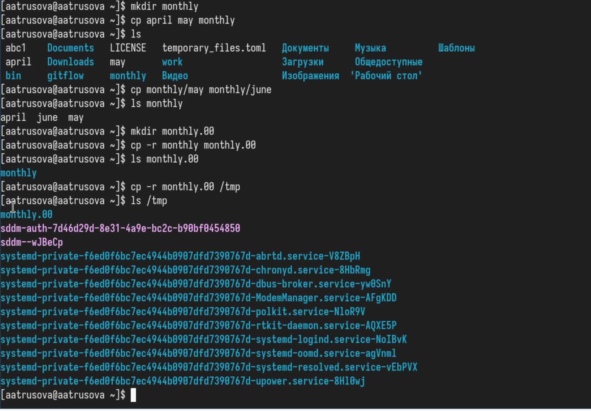{#fig:001 width=70%}

## Перемещение и переименование файлов и каталогов

Переименую файл april в july. Переименую каталог monthly.00 в monthly.01. Создала каталог reports, переместила туда каталог monthly.01. Переименовала monthly.01 в monthly. Попутно проверяла правильность выполнения (рис. [-@fig:002]).

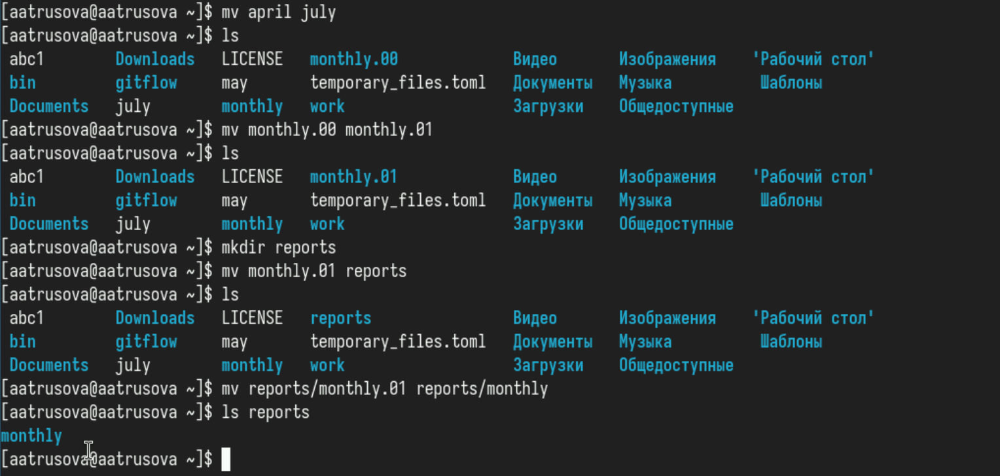{#fig:002 width=70%}

## Права доступа

Меняю права доступа на ранее созданный файл may и проверяю изменения. Меняю права доступа на каталог monthly и файл abc1 (рис. [-@fig:003]).

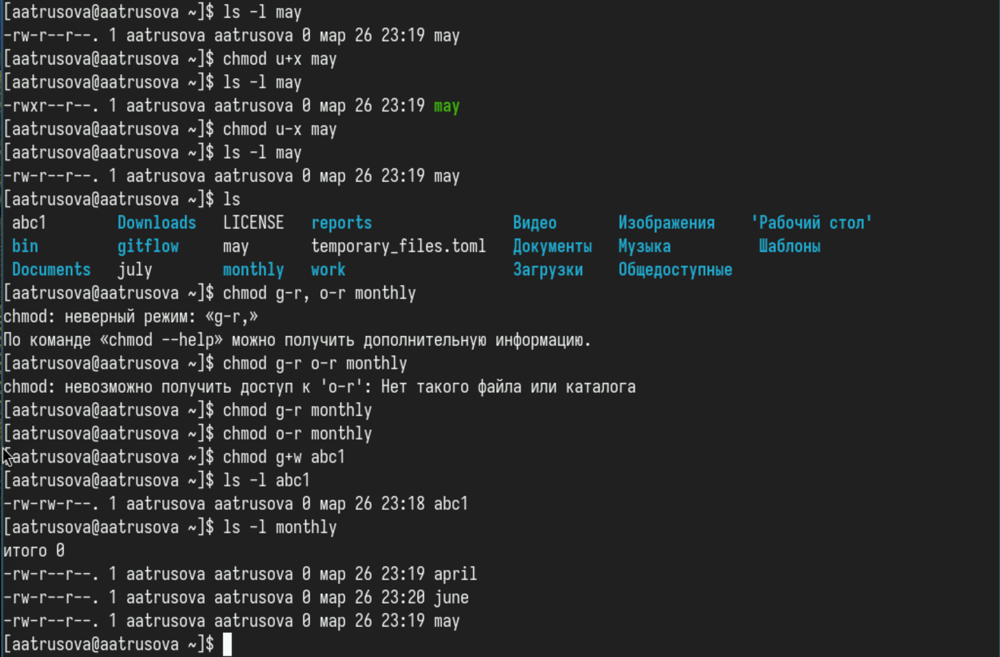{#fig:003 width=70%}

## Анализ файловой системы

Смотрю используемые в операционной системы файловые системы (рис. [-@fig:004]).

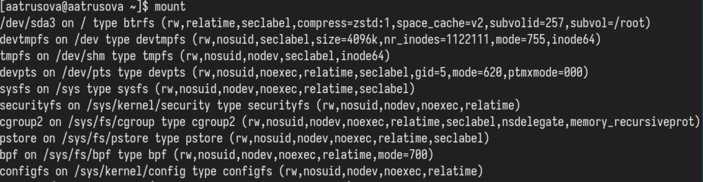{#fig:004 width=70%}

## Анализ файловой системы

Смотрю смонтированные в операционной системе файловые системе с помощью cat (рис. [-@fig:005]).

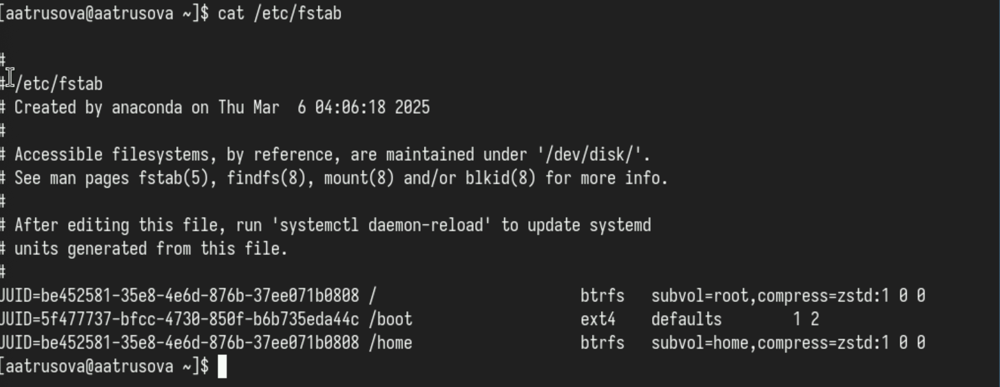{#fig:005 width=70%}

## Анализ файловой системы

Проверяю объём свободного пространства файловых систем с помощью df (рис. [-@fig:006]).

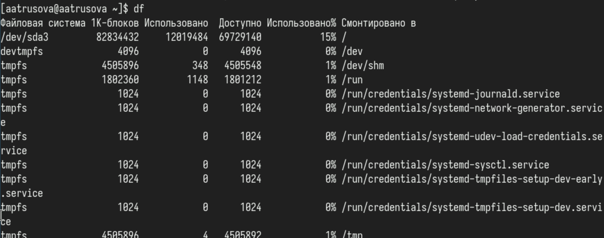{#fig:006 width=70%}

## Анализ файловой системы

Проверяю целостность файловой системы с помощью fsck (рис. [-@fig:007]).

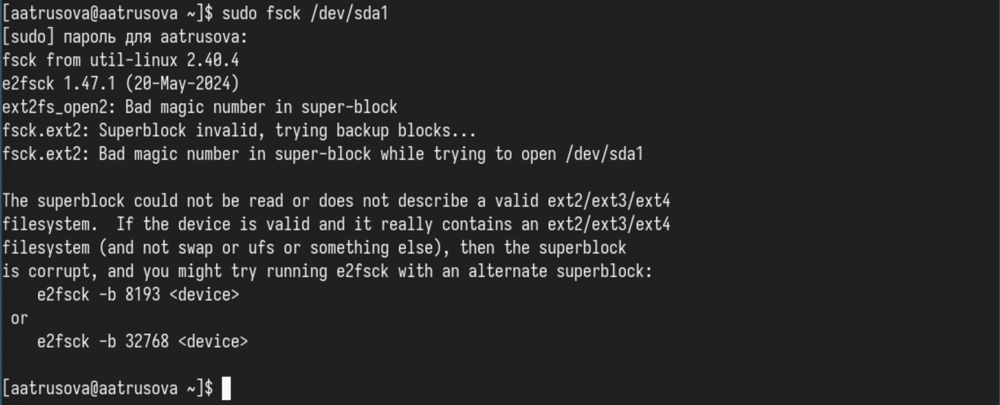{#fig:007 width=70%}

## Копирование и перемещение каталогов

Копирую файл /usr/include/sys/io.h в домашний каталог с названием equipment (рис. [-@fig:008]).

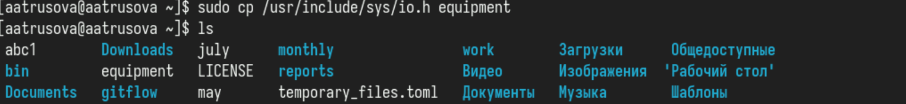{#fig:008 width=70%}

## Копирование и перемещение каталогов

В домашнем каталоге создаю каталог ski.plases, перемещаю в него файл equipment и переименовываю его в equiplist. В тот же каталог копирую файл abc1 и переименовываю его в equiplist2. В каталоге ski.plases создаю подкаталог equipment и перемещаю туда файлы equiplist и equiplist2. В домашнем каталоге создаю новый каталог newdir, перемещаю его в каталог ski.plases и переменывавю в plans (рис. [-@fig:009]).

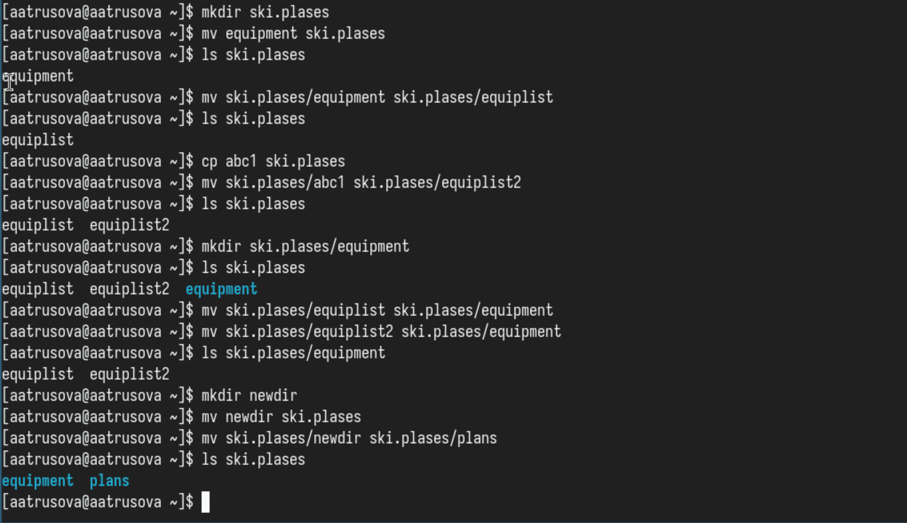{#fig:009 width=70%}

## Опции команды chmod

Создаю тестовый репозиторий, чтобы в нём делать необходимые для задания каталоги (потом всё равно перемещу их в корневой каталог). Создаю каталог australia для необходимого вида прав доступа прописываю chmod с опциями u+x, g-x, о-x (рис. [-@fig:010]).

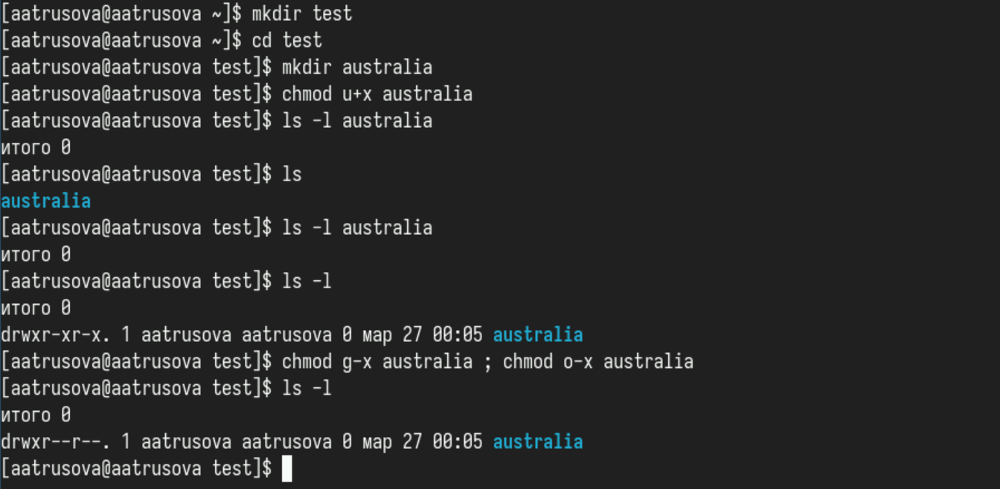{#fig:010 width=70%}

## Опции команды chmod

Создаю каталог play и прописываю chmod с опциями g-r, o-r (рис. [-@fig:011]).

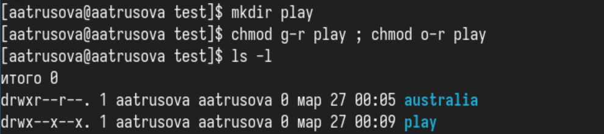{#fig:011 width=70%}

## Опции команды chmod

Создаю файлы my_os и feathers, для первого прописываю опции u-w, u+x для второго опцию g+w (рис. [-@fig:012]).

{#fig:012 width=70%}

## Изменение прав доступа к файлам и каталогам

Попыталась посмотреть содержимое файла /etc/password, но такого файла не оказалось :( (рис. [-@fig:013]).

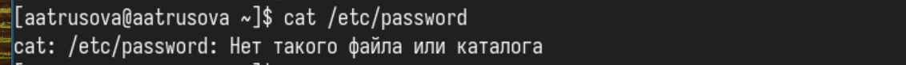{#fig:013 width=70%}

## Изменение прав доступа к файлам и каталогам

Скопировала файл ~/feathers в файл ~/file.old, переместила файл ~/file.old в каталог ~/play, скопировала каталог ~/play в каталог ~/fun (рис. [-@fig:014]).

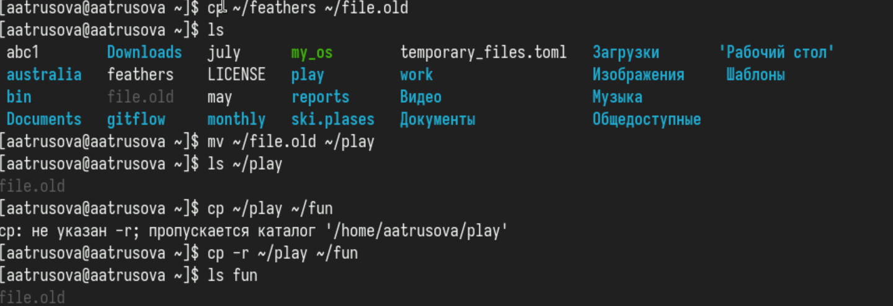{#fig:014 width=70%}

## Изменение прав доступа к файлам и каталогам

Переместила каталог ~/fun в каталог ~/play с названием games. Лишила владельца файла ~/feathers права на чтение. При попытке прочтения и копирования пишет "отказано в доступе". Дала владельцу файла ~/feathers право на чтение. Лишила владельца каталога ~/play права на выполнение. При попытке перейти в каталог пишет "отказано в доступе". Дала владельцу каталога ~/play право на выполнение (рис. [-@fig:015]).

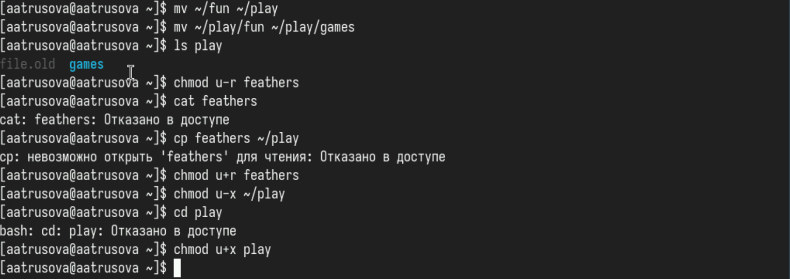{#fig:015 width=70%}

## Команды mount, fsck, mkfs, kill.

1. mount используется для подключения файловых систем к дереву каталогов в Unix-подобных системах. Она позволяет монтировать устройства, такие как жесткие диски, USB-накопители и сетевые файловые системы.

Пример: mount /dev/sdb1 /mnt/usb

В этом примере устройство /dev/sdb1 монтируется в каталог /mnt/usb. После выполнения этой команды содержимое устройства будет доступно в указанном каталоге.

## Команды mount, fsck, mkfs, kill.

2. fsck (file system check) используется для проверки и исправления ошибок в файловых системах. Она может быть полезна для восстановления файловых систем после сбоев или некорректного отключения.

Пример: fsck /dev/sda1

В этом примере команда проверяет файловую систему на устройстве /dev/sda1 на наличие ошибок и пытается их исправить. Обычно fsck нужно запускать, когда файловая система не смонтирована.

## Команды mount, fsck, mkfs, kill.

3. mkfs (make filesystem) используется для создания файловой системы на устройстве. Это удаляет все данные на устройстве и подготавливает его для использования.

Пример: mkfs.ext4 /dev/sdb1

В этом примере создается файловая система типа ext4 на устройстве /dev/sdb1. После выполнения этой команды устройство будет готово к монтированию и использованию.

## Команды mount, fsck, mkfs, kill.

4. kill используется для отправки сигналов процессам. Наиболее часто используется для завершения процессов. По умолчанию kill отправляет сигнал TERM, который запрашивает процесс о завершении.

Пример: kill 1234

В этом примере процесс с идентификатором (PID) 1234 будет завершен. Если процесс не реагирует на стандартный сигнал, можно использовать более жесткий сигнал, например KILL: kill -9 1234

Этот сигнал принудительно завершает процесс.

# Выводы

Я ознакомилась с файловой системой Linux, её структурой, именами и содержанием каталогов, приобрела практические навыки по применению команд для работы с файлами и каталогами, по управлению процессами (и работами), по проверке использования диска и обслуживанию файловой системы.
