---
## Front matter
lang: ru-RU
title: Лабораторная работа №9
subtitle: Операционные системы
author:
  - Трусова А. А.
institute:
  - Российский университет дружбы народов, Москва, Россия
date: 12 апреля 2025

## i18n babel
babel-lang: russian
babel-otherlangs: english

## Formatting pdf
toc: false
toc-title: Содержание
slide_level: 2
aspectratio: 169
section-titles: true
theme: metropolis
header-includes:
 - \metroset{progressbar=frametitle,sectionpage=progressbar,numbering=fraction}
---

# Информация

## Докладчик

:::::::::::::: {.columns align=center}
::: {.column width="70%"}

  * Трусова Алина Александровна
  * НКАбд-05-24, студ. билет №1132246715
  * Российский университет дружбы народов
  * [1132246715@pfur.ru](mailto:1132246715@pfur.ru)
  * <https://github.com/alas-aline>

:::
::: {.column width="30%"}

:::
::::::::::::::

# Вводная часть

## Цель

Освоение основных возможностей командной оболочки Midnight Commander. Приобретение навыков практической работы по просмотру каталогов и файлов; манипуляций с ними.

## Задачи

1. Выполнить задания по mc.
2. Выполнить задания по встроенному редактору mc.

# Теоретическое введение

Командная оболочка — интерфейс взаимодействия пользователя с операционной системой и программным обеспечением посредством команд.
Midnight Commander (или mc) — псевдографическая командная оболочка для UNIX/Linux систем. Для запуска mc необходимо в командной строке набрать mc и нажать Enter.

# Выполнение лабораторной работы

## Задания по mc

Изучила информацию о mc, вызвав в командной строке man mc (рис. [-@fig:001]).

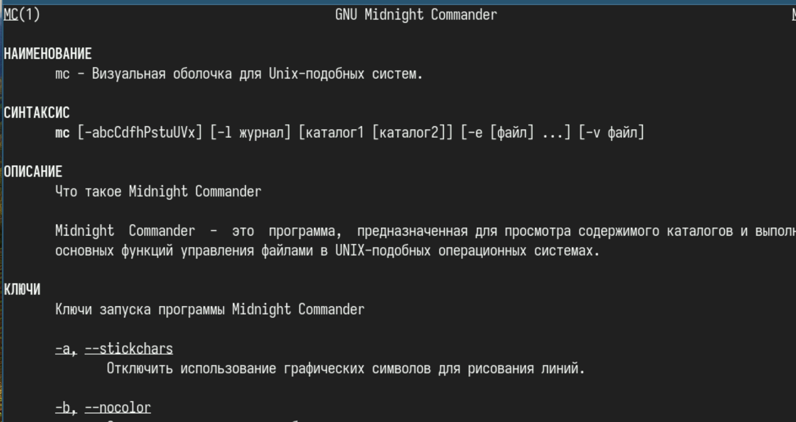{#fig:001 width=70%}

## Задания по mc

Запустила из командной строки mc, изучила его структуру и меню (рис. [-@fig:002]).

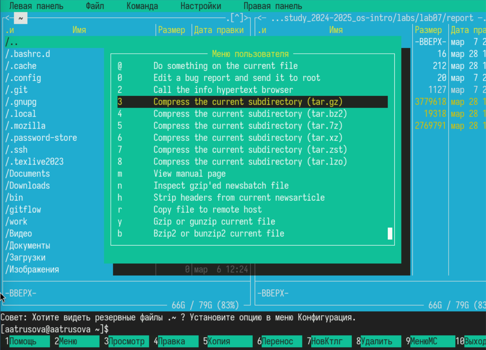{#fig:002 width=70%}

## Задания по mc

Скопировала файл из одной панели в другую (рис. [-@fig:003]).

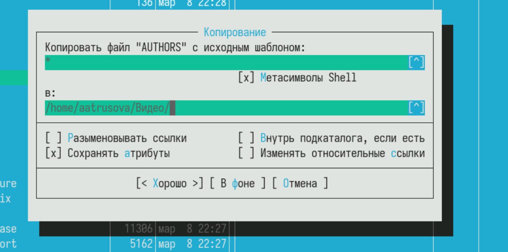{#fig:003 width=70%}

## Задания по mc

Посмотрела права доступа к файлу (рис. [-@fig:004]).

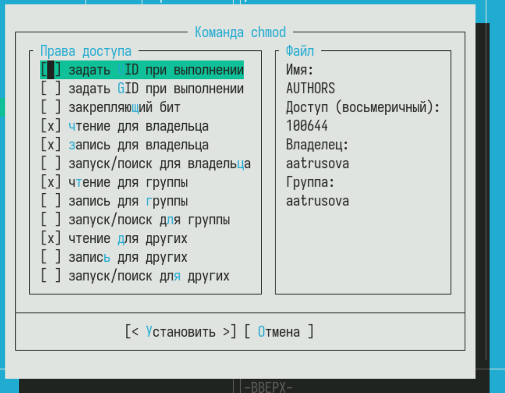{#fig:004 width=70%}

## Задания по mc

C помощью подменю Файл посмотрела содержимое файла (рис. [-@fig:005]).

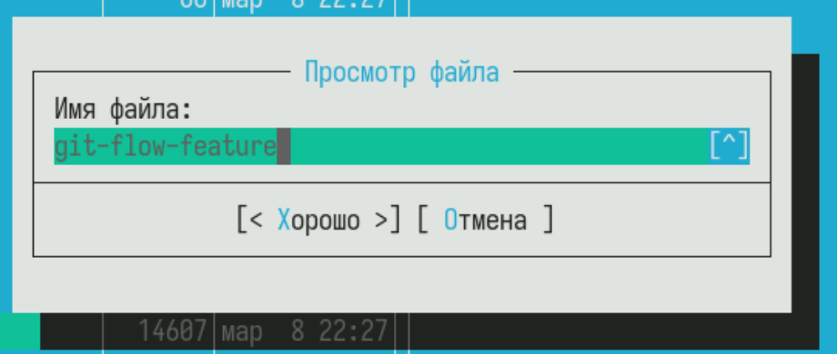{#fig:005 width=70%}

## Задания по mc

Создала новый каталог test, с которым буду работать в дальнейшем (рис. [-@fig:006]).

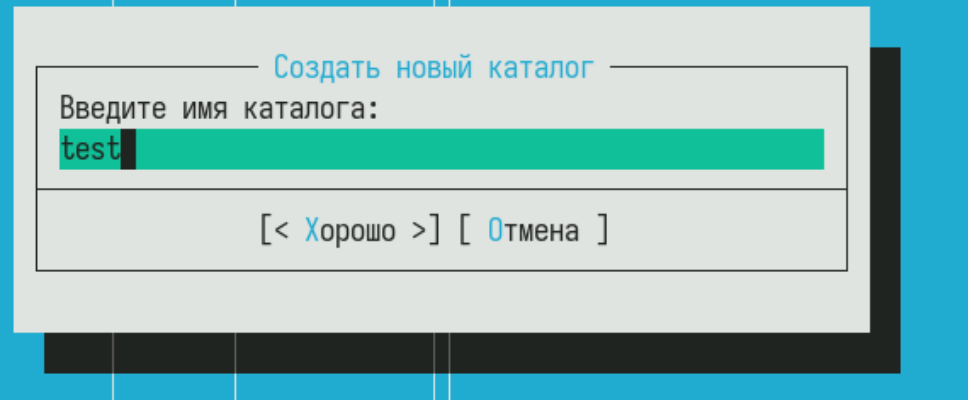{#fig:006 width=70%}

## Задания по mc

Скопировала свой старый отчёт в новый каталог (рис. [-@fig:007]).

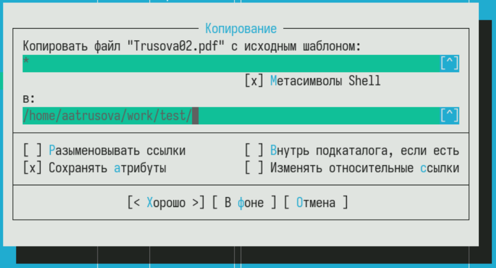{#fig:007 width=70%}

## Задания по mc

С помощью подменю Команда в каталоге /home ищу все файлы, содержащие слово main (рис. [-@fig:008]).

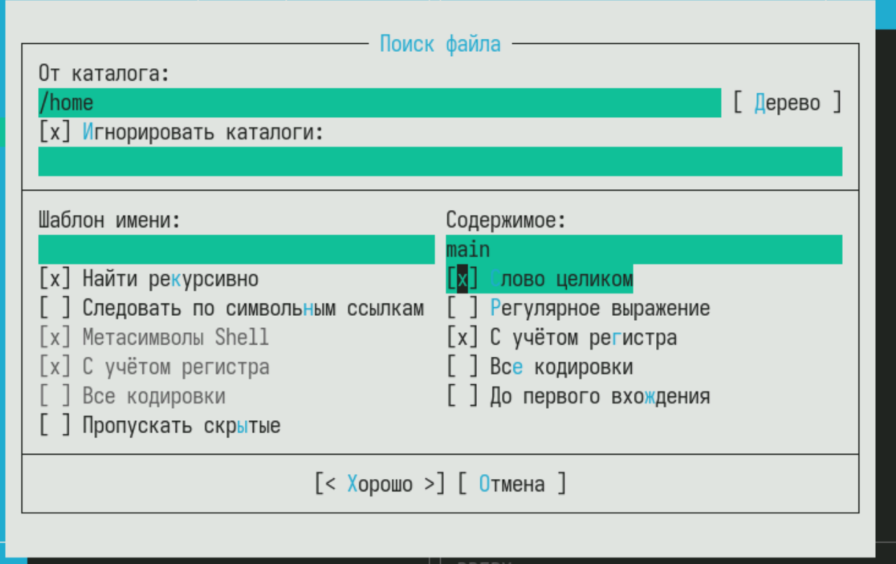{#fig:008 width=70%}

## Задания по mc

Вот, что он нашёл (рис. [-@fig:009]).

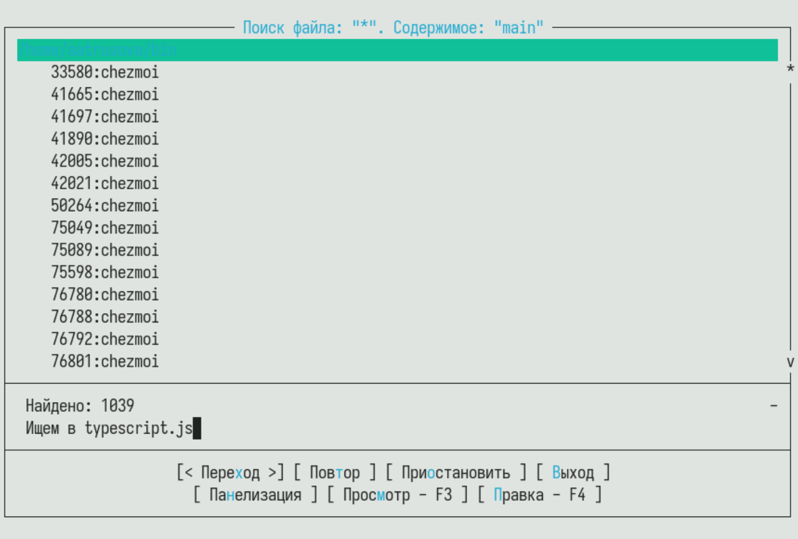{#fig:009 width=70%}

## Задания по mc

Открыла историю команд и повторила одну из них (рис. [-@fig:010]).

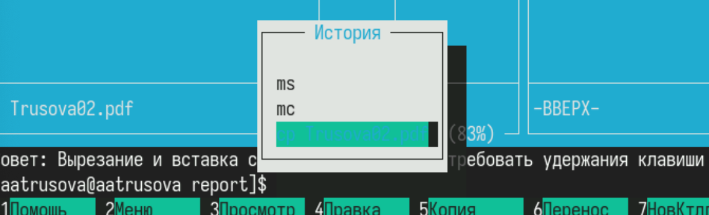{#fig:010 width=70%}

## Задания по mc

Перешла в домашний каталог с помощью дерева каталогов (рис. [-@fig:011]).

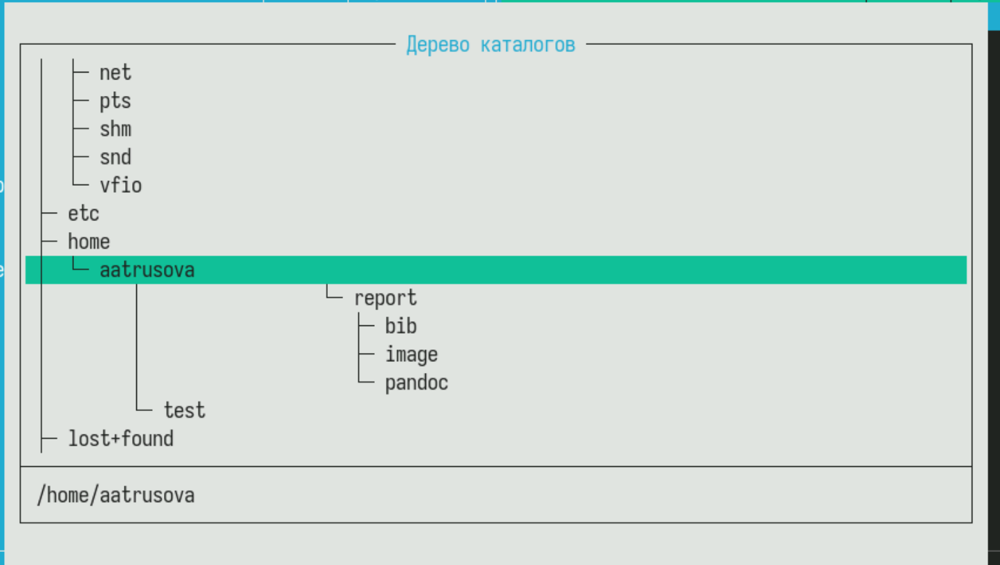{#fig:011 width=70%}

## Задания по mc

Проанализировала файл расширений (рис. [-@fig:012]).

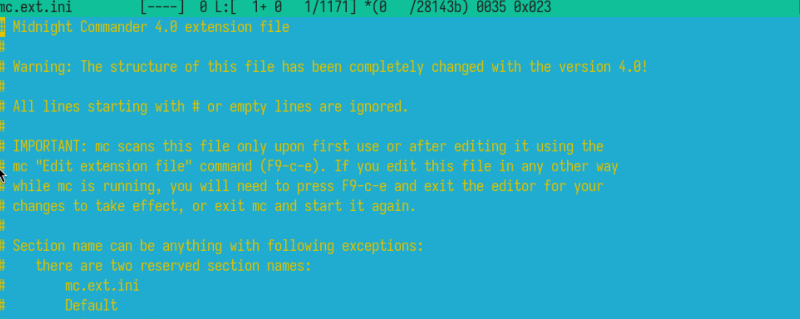{#fig:012 width=70%}

## Задания по mc

И файл меню (рис. [-@fig:013]).

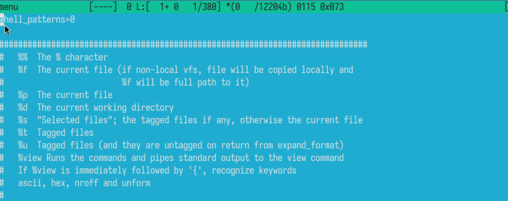{#fig:013 width=70%}

## Задания по mc

Вызвала подменю Настройки и изучила его функции (рис. [-@fig:014]).

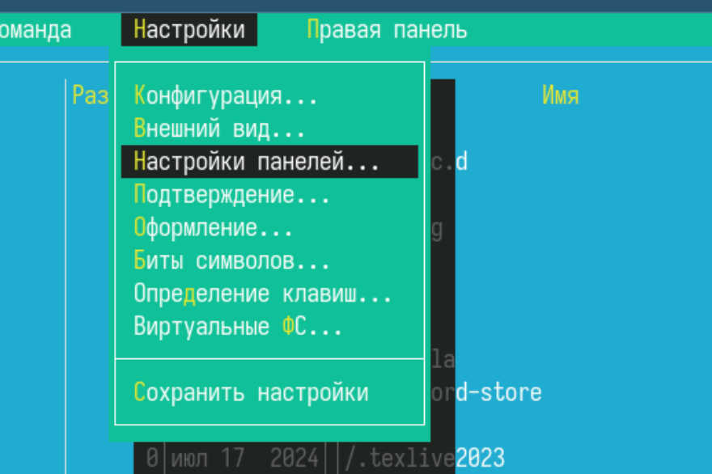{#fig:014 width=70%}

## Задания по встроенному редактору mc 

Создала файл text.txt (рис. [-@fig:015]).

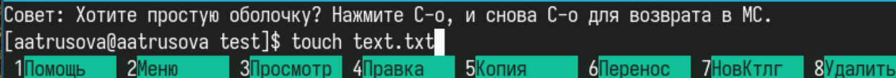{#fig:015 width=70%}

## Задания по встроенному редактору mc 

Для последующих заданий я не смогла использовать горячий клавиши, т.к. у меня нет необходимой клавиши на ноутбуке, поэтому задания я делала через подменю Правка.

## Задания по встроенному редактору mc 

Удалить строку - удалить, копировать - копировать в файл буфера обмена, переместить фрагмент - переместить блок, перейти в начало - начало файла, перейти в конец - конец файла (рис. [-@fig:016]).

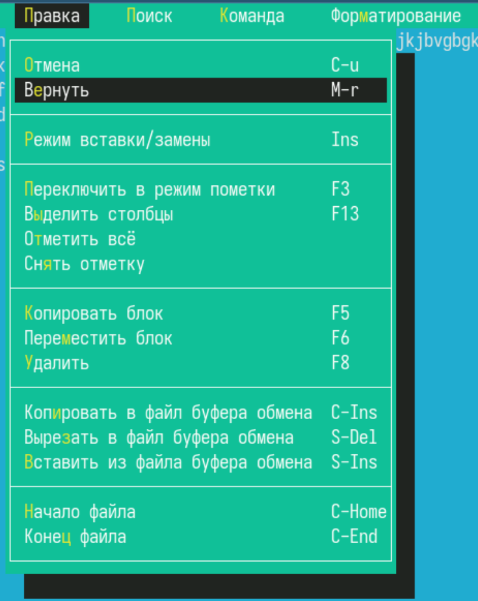{#fig:016 width=70%}

## Задания по встроенному редактору mc 

Скопировала код на С++ в тестовый каталог (рис. [-@fig:017]).

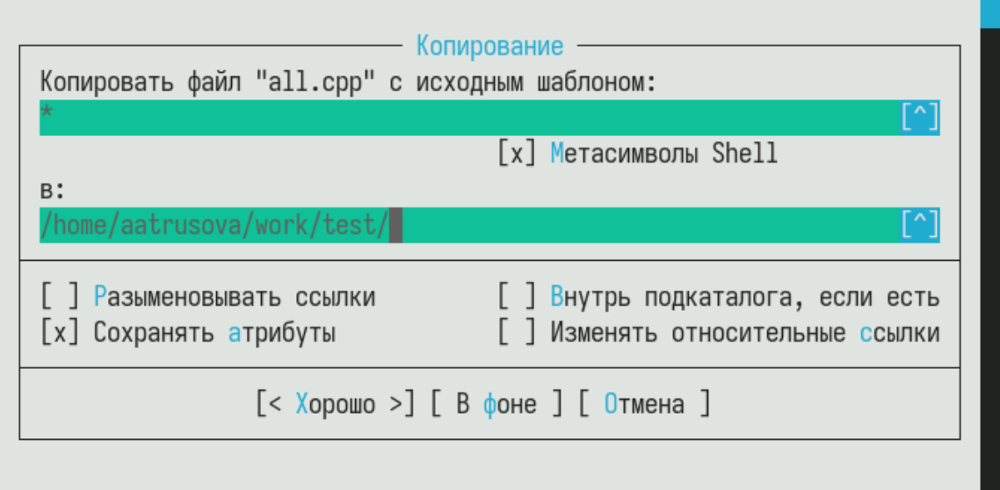{#fig:017 width=70%}

## Задания по встроенному редактору mc 

Выключила подсветку синтаксиса, поставив unknown (рис. [-@fig:018]).

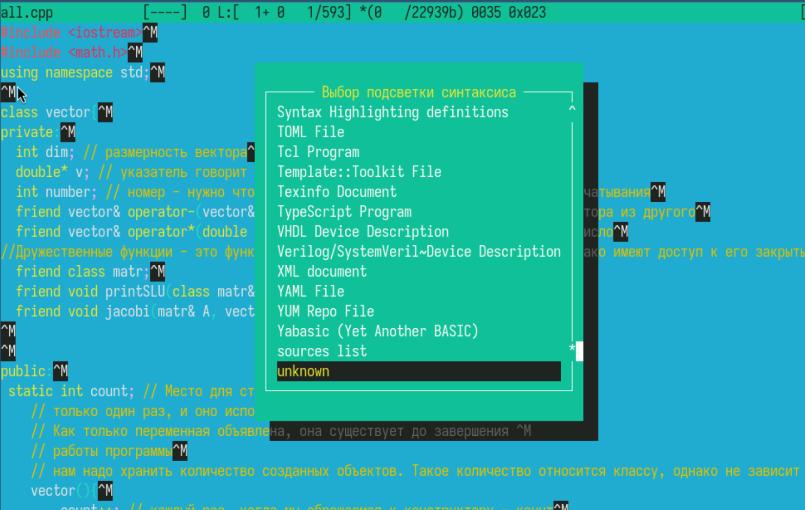{#fig:018 width=70%}

# Выводы

Я освоила основные возможности командной оболочки Midnight Commander. Приобретела навыки практической работы по просмотру каталогов и файлов; манипуляций с ними.
