---
## Front matter
title: "Лабораторная работа №9"
subtitle: "Операционные системы"
author: "Трусова Алина Александровна"

## Generic otions
lang: ru-RU
toc-title: "Содержание"

## Bibliography
bibliography: bib/cite.bib
csl: pandoc/csl/gost-r-7-0-5-2008-numeric.csl

## Pdf output format
toc: true # Table of contents
toc-depth: 2
lof: true # List of figures
lot: true # List of tables
fontsize: 12pt
linestretch: 1.5
papersize: a4
documentclass: scrreprt
## I18n polyglossia
polyglossia-lang:
  name: russian
  options:
	- spelling=modern
	- babelshorthands=true
polyglossia-otherlangs:
  name: english
## I18n babel
babel-lang: russian
babel-otherlangs: english
## Fonts
mainfont: IBM Plex Serif
romanfont: IBM Plex Serif
sansfont: IBM Plex Sans
monofont: IBM Plex Mono
mathfont: STIX Two Math
mainfontoptions: Ligatures=Common,Ligatures=TeX,Scale=0.94
romanfontoptions: Ligatures=Common,Ligatures=TeX,Scale=0.94
sansfontoptions: Ligatures=Common,Ligatures=TeX,Scale=MatchLowercase,Scale=0.94
monofontoptions: Scale=MatchLowercase,Scale=0.94,FakeStretch=0.9
mathfontoptions:
## Biblatex
biblatex: true
biblio-style: "gost-numeric"
biblatexoptions:
  - parentracker=true
  - backend=biber
  - hyperref=auto
  - language=auto
  - autolang=other*
  - citestyle=gost-numeric
## Pandoc-crossref LaTeX customization
figureTitle: "Рис."
tableTitle: "Таблица"
listingTitle: "Листинг"
lofTitle: "Список иллюстраций"
lotTitle: "Список таблиц"
lolTitle: "Листинги"
## Misc options
indent: true
header-includes:
  - \usepackage{indentfirst}
  - \usepackage{float} # keep figures where there are in the text
  - \floatplacement{figure}{H} # keep figures where there are in the text
---

# Цель работы

Освоение основных возможностей командной оболочки Midnight Commander. Приобретение навыков практической работы по просмотру каталогов и файлов; манипуляций с ними.

# Задание

1. Выполнить задания по mc.
2. Выполнить задания по встроенному редактору mc.
3. Ответить на контрольные вопросы.

# Теоретическое введение

Командная оболочка — интерфейс взаимодействия пользователя с операционной системой и программным обеспечением посредством команд.
Midnight Commander (или mc) — псевдографическая командная оболочка для UNIX/Linux систем. Для запуска mc необходимо в командной строке набрать mc и нажать Enter.

# Выполнение лабораторной работы

## Задания по mc

Изучила информацию о mc, вызвав в командной строке man mc (рис. [-@fig:001]).

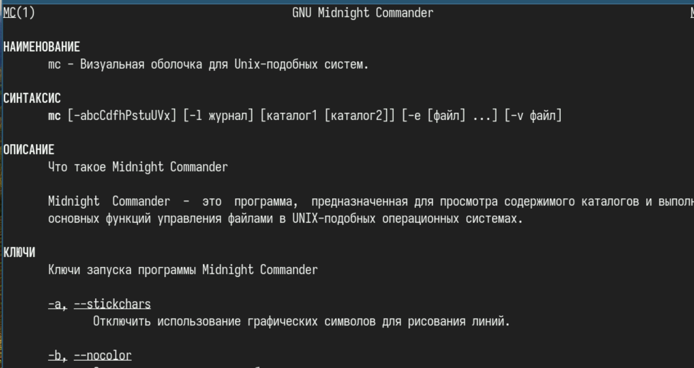{#fig:001 width=70%}

Запустила из командной строки mc, изучила его структуру и меню (рис. [-@fig:002]).

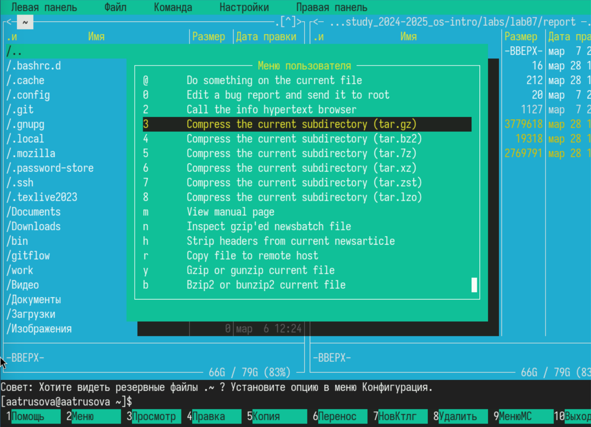{#fig:002 width=70%}

Скопировала файл из одной панели в другую (рис. [-@fig:003]).

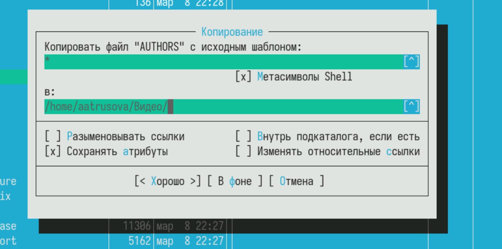{#fig:003 width=70%}

Посмотрела права доступа к файлу (рис. [-@fig:004]).

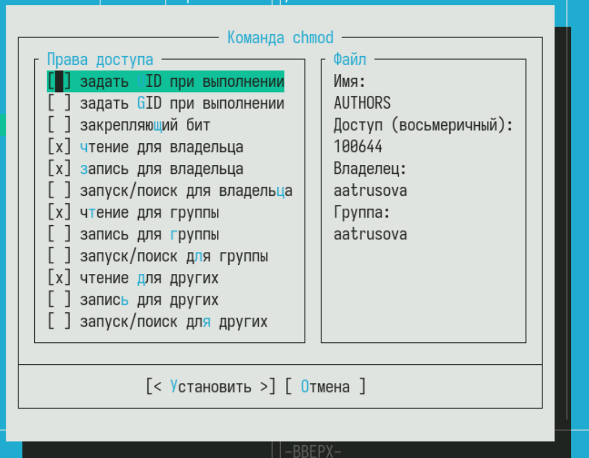{#fig:004 width=70%}

C помощью подменю Файл посмотрела содержимое файла (рис. [-@fig:005]).

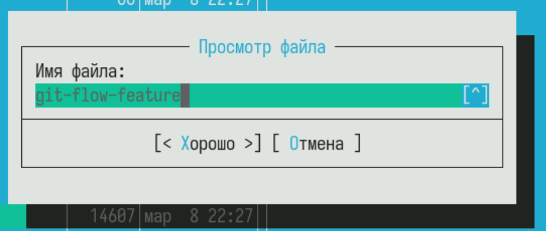{#fig:005 width=70%}

Создала новый каталог test, с которым буду работать в дальнейшем (рис. [-@fig:006]).

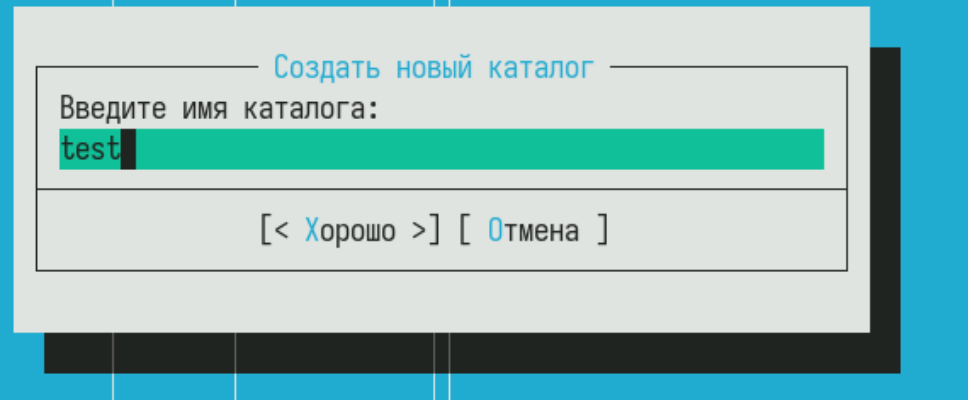{#fig:006 width=70%}

Скопировала свой старый отчёт в новый каталог (рис. [-@fig:007]).

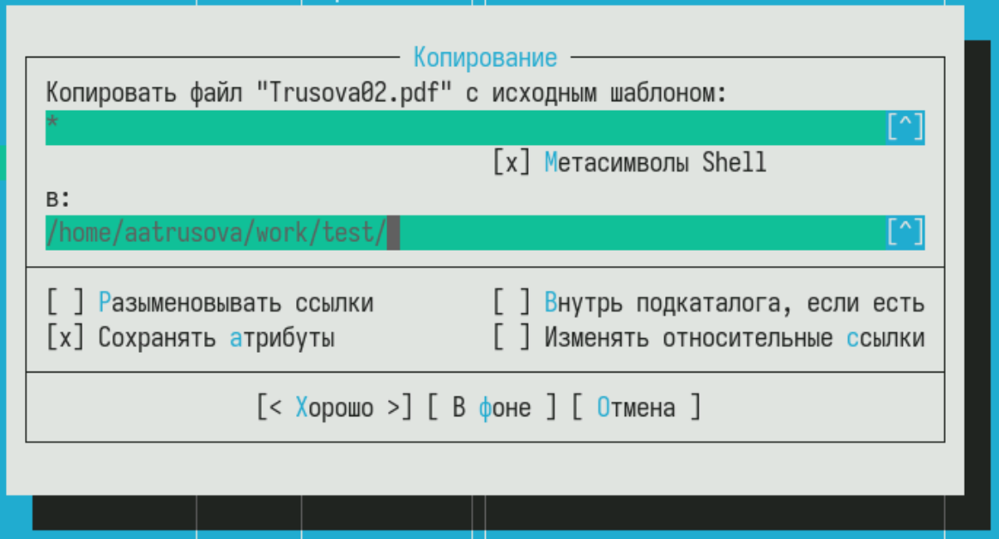{#fig:007 width=70%}

С помощью подменю Команда в каталоге /home ищу все файлы, содержащие слово main (рис. [-@fig:008]).

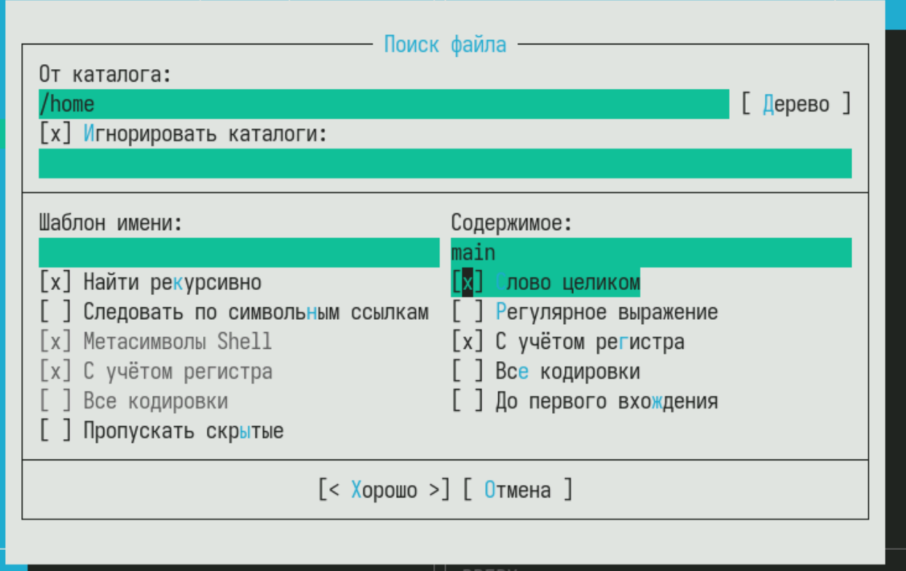{#fig:008 width=70%}

Вот, что он нашёл (рис. [-@fig:009]).

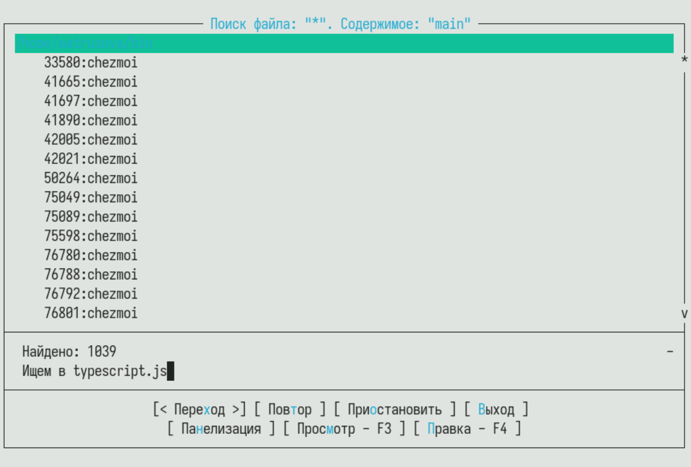{#fig:009 width=70%}

Открыла историю команд и повторила одну из них (рис. [-@fig:010]).

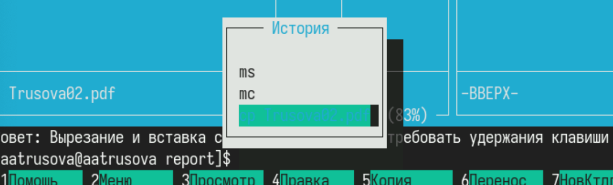{#fig:010 width=70%}

Перешла в домашний каталог с помощью дерева каталогов (рис. [-@fig:011]).

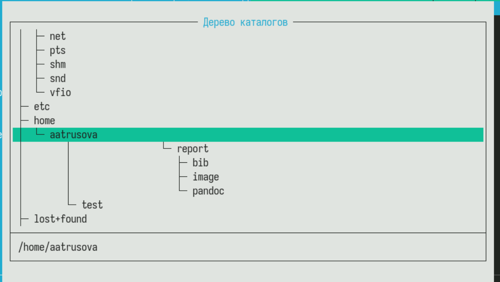{#fig:011 width=70%}

Проанализировала файл расширений (рис. [-@fig:012]).

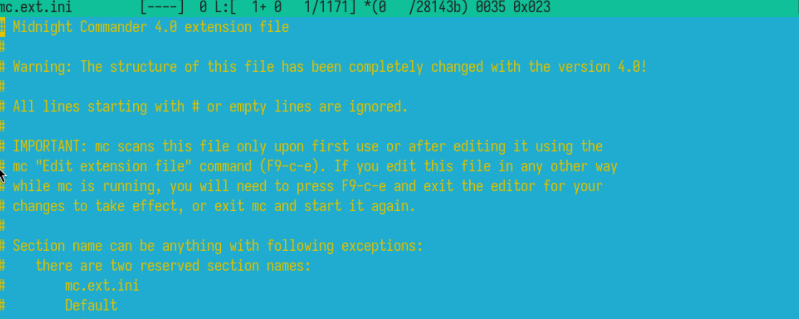{#fig:012 width=70%}

И файл меню (рис. [-@fig:013]).

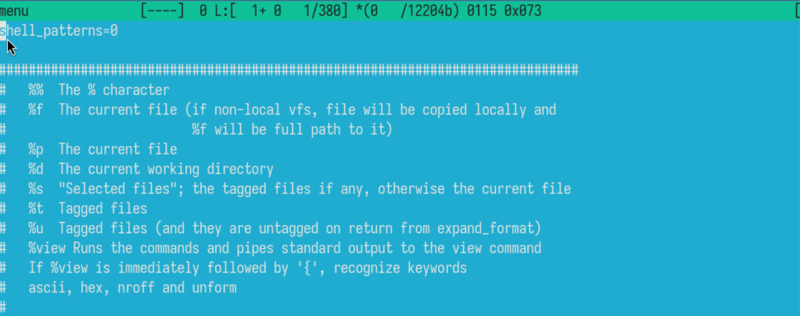{#fig:013 width=70%}

Вызвала подменю Настройки и изучила его функции (рис. [-@fig:014]).

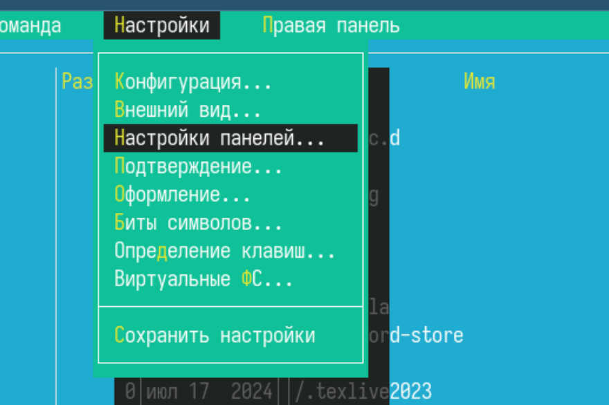{#fig:014 width=70%}

## Задания по встроенному редактору mc 

Создала файл text.txt (рис. [-@fig:015]).

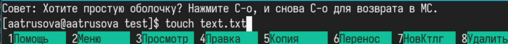{#fig:015 width=70%}

Для последующих заданий я не смогла использовать горячий клавиши, т.к. у меня нет необходимой клавиши на ноутбуке, поэтому задания я делала через подменю Правка.

Удалить строку - удалить, копировать - копировать в файл буфера обмена, переместить фрагмент - переместить блок, перейти в начало - начало файла, перейти в конец - конец файла (рис. [-@fig:016]).

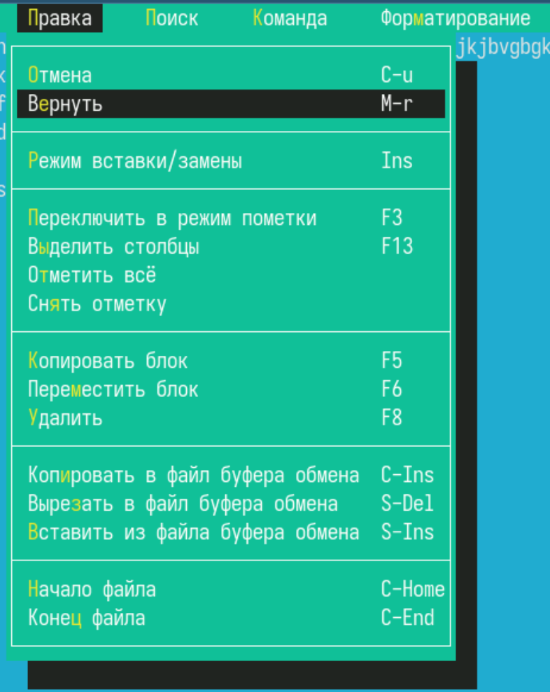{#fig:016 width=70%}

Скопировала код на С++ в тестовый каталог (рис. [-@fig:017]).

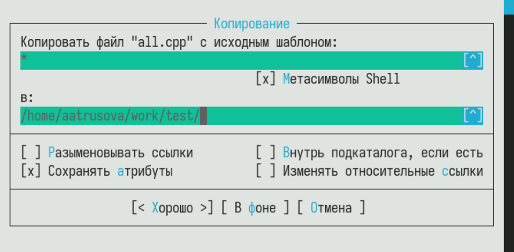{#fig:017 width=70%}

Выключила подсветку синтаксиса, поставив unknown (рис. [-@fig:018]).

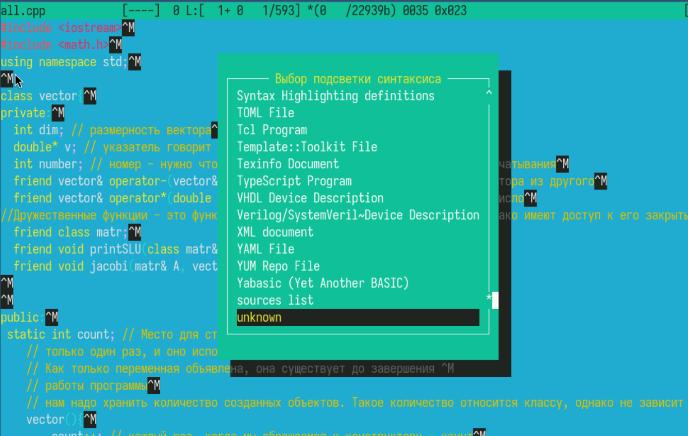{#fig:018 width=70%}

## Контрольные вопросы

1. Режимы работы в Midnight Commander (mc)

Midnight Commander поддерживает несколько режимов работы:

* Файловый режим (стандартный) – просмотр, копирование, перемещение файлов.
* Редактирование (F4) – встроенный (mcedit) или внешний редактор (nano, vim).
* Просмотр (F3) – быстрый просмотр содержимого файла без редактирования.
* Командная строка (Ctrl+O) – временный выход в shell без закрытия mc.
* Меню (F9) – доступ к настройкам и дополнительным функциям.

2. Операции с файлами в mc и через shell

Через mc (горячие клавиши):

* F5 – копирование
* F6 – перемещение/переименование
* F8 – удаление
* Insert – выделение файлов
* Ctrl+T – массовое выделение

Через shell (команды):

* cp file.txt /backup/ – копирование
* mv file.txt newname.txt – перемещение/переименование
* rm file.txt – удаление

3. Структура меню левой/правой панели (Left/Right) в mc

* Краткий/полный список – изменение формата отображения
* Информация – показывает размер, права доступа
* Дерево каталогов – отображение в виде дерева
* Быстрый просмотр – аналог F3, но для панели
* Фильтр – отображение только файлов по маске (например, *.txt)

4. Структура меню "Файл" (File) в mc

* Просмотр (F3) – открыть файл для чтения
* Правка (F4) – редактирование
* Копирование (F5) – копировать файл/папку
* Переименование/перемещение (F6)
* Создание каталога (F7)
* Удаление (F8)
* Ссылка – создание символьной или жесткой ссылки

5. Структура меню "Команды" (Command) в mc

* Поиск файла (Alt+?)
* История командной строки (Ctrl+E)
* Перейти в каталог (Alt+C)
* Сравнение каталогов (Ctrl-X D)
* Выход (F10)

6. Структура меню "Настройки" (Options) в mc

* Конфигурация – настройки интерфейса
* Внешний редактор – выбор редактора (mcedit, nano, vim)
* Права доступа (Ctrl+X C) – смена chmod
* Подсветка синтаксиса – для редактора

7. Встроенные команды mc

* cd – смена каталога
* ls – вывод содержимого
* cp/mv/rm – копирование, перемещение, удаление
* chmod/chown – управление правами
* diff – сравнение файлов

8. Команды встроенного редактора (mcedit)

* F2 – сохранить
* F3 – поиск
* F5 – копировать текст
* F6 – переместить текст
* F10 – выход

9. Пользовательские меню в mc

~/.mc.menu – файл для создания своих меню. Вызывается через F2 → "Мои команды".

10. Пользовательские действия над файлами

~/.mc.ext – настройка действий по расширению.

# Выводы

Я освоила основные возможности командной оболочки Midnight Commander. Приобретела навыки практической работы по просмотру каталогов и файлов; манипуляций с ними [@lab].

# Список литературы{.unnumbered}

::: {#refs}
:::
